# 报告

Turbo EA 包含强大的**可视化报告**模块，允许从不同角度分析企业架构。所有报告都可以[保存以便复用](saved-reports.md)，包括当前的筛选和轴配置。

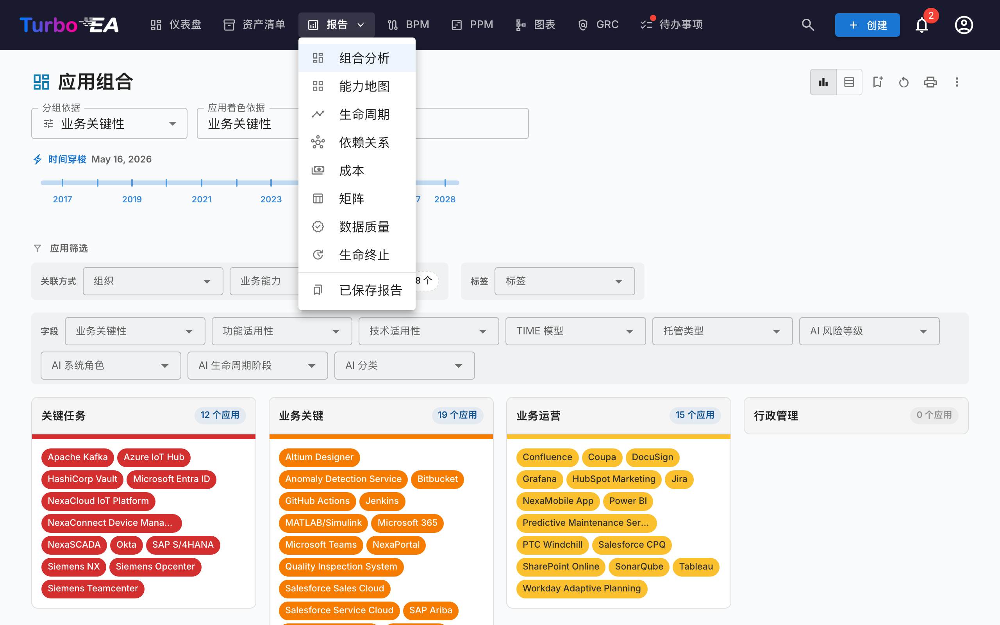

## 投资组合报告

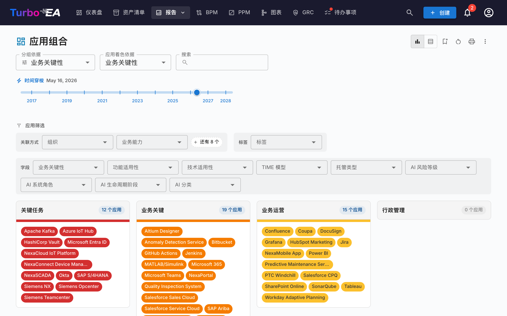

**投资组合报告**显示卡片的可配置**气泡图**（或散点图）。您可以选择每个轴代表什么：

- **X 轴** —— 选择任何数字或选择字段（例如技术适用性）
- **Y 轴** —— 选择任何数字或选择字段（例如业务关键性）
- **气泡大小** —— 映射到数字字段（例如年度成本）
- **气泡颜色** —— 映射到选择字段或生命周期状态

这非常适合投资组合分析 —— 例如按业务价值与技术适用性绘制应用程序，以确定投资、替换或退役的候选对象。

### AI 投资组合洞察

当 AI 已配置且管理员已启用投资组合洞察时，投资组合报告会显示一个 **AI 洞察** 按钮。点击该按钮会将当前视图的摘要发送给 AI 提供商，后者会返回关于集中风险、现代化机会、生命周期问题和投资组合平衡的战略洞察。洞察面板可折叠，在更改筛选条件或分组后可以重新生成。

## 能力地图

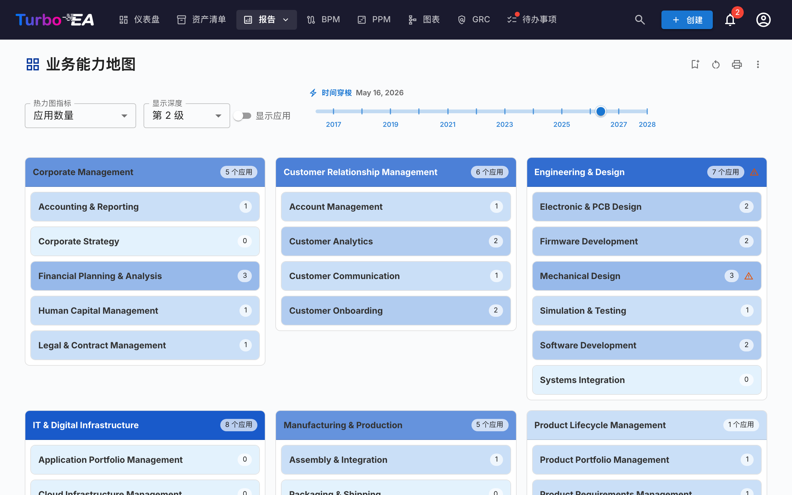

**能力地图**显示组织业务能力的层级**热力图**。每个块代表一个能力，具有：

- **层级结构** —— 主要能力包含其子能力
- **热力图着色** —— 块根据选定的指标着色（例如支持的应用程序数量、平均数据质量或风险等级）
- **点击探索** —— 点击任何能力可深入查看其详情和支持的应用程序

## 生命周期报告

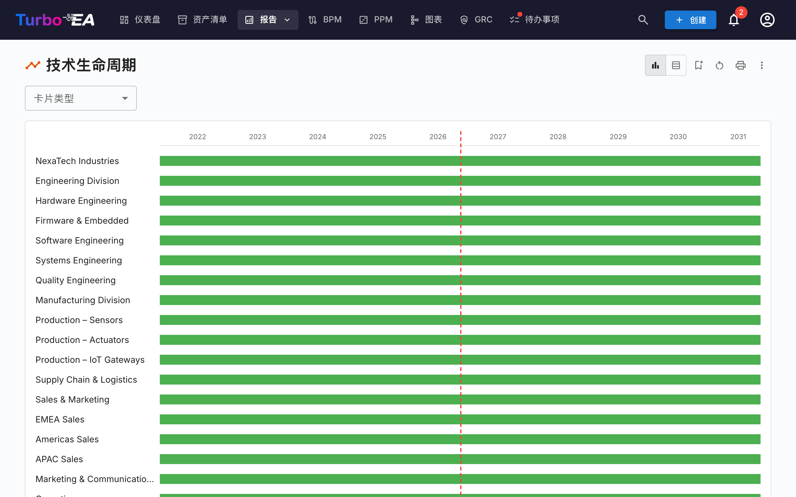

**生命周期报告**显示技术组件引入时间和计划退役时间的**时间线可视化**。对以下方面至关重要：

- **退役规划** —— 查看哪些组件即将到达生命周期终点
- **投资规划** —— 识别需要新技术的空缺
- **迁移协调** —— 可视化引入和淘汰的重叠期

组件以横跨其生命周期阶段的水平条显示：规划、引入、活跃、淘汰和生命周期结束。

## 依赖关系报告

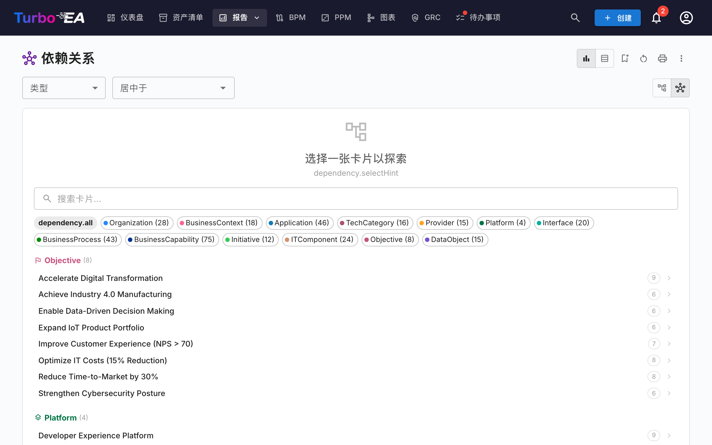

**依赖关系报告**将**组件之间的连接**可视化为网络图。节点代表卡片，边代表关系。功能包括：

- **深度控制** —— 限制从中心节点显示多少跳（BFS 深度限制）
- **类型筛选** —— 仅显示特定的卡片类型和关系类型
- **交互式探索** —— 点击任何节点将图表重新居中到该卡片
- **影响分析** —— 了解对特定组件变更的影响范围

### C4 图表视图

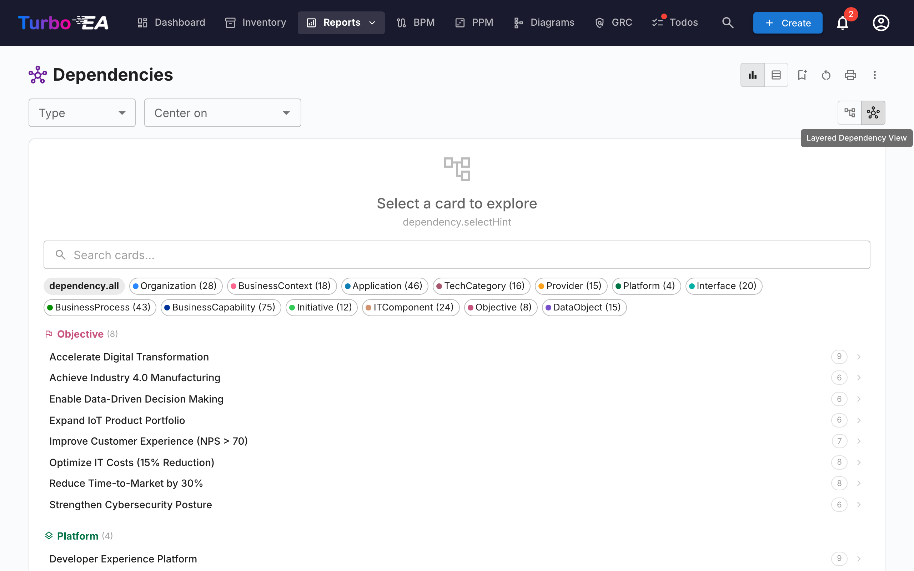

使用工具栏中的视图模式按钮切换到 **C4 图表**视图。该视图使用 C4 表示法渲染相同的依赖关系数据：

- **边界框** —— 卡片按架构层（战略、业务、应用、技术）分组在虚线边界矩形内
- **交互式画布** —— 平移、缩放并使用小地图导航大型图表
- **点击检查** —— 点击任何节点可打开卡片详情侧面板
- **无需中心卡片** —— C4 视图显示所有匹配当前类型筛选的卡片
- **连接高亮** —— 将鼠标悬停在卡片上可高亮显示其连接；在触控设备上，使用控制面板中的高亮切换按钮通过点击来高亮

## 成本报告

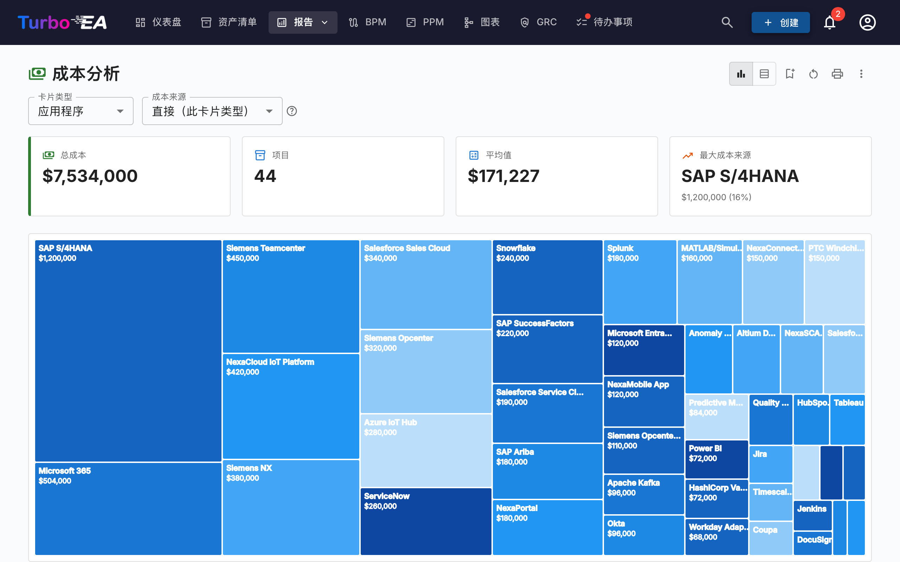

**成本报告**提供技术架构的财务分析：

- **树状图视图** —— 按成本大小排列的嵌套矩形，可选分组（例如按组织或能力）
- **柱状图视图** —— 跨组件的成本比较
- **聚合** —— 成本可以使用计算字段从关联卡片汇总

## 矩阵报告

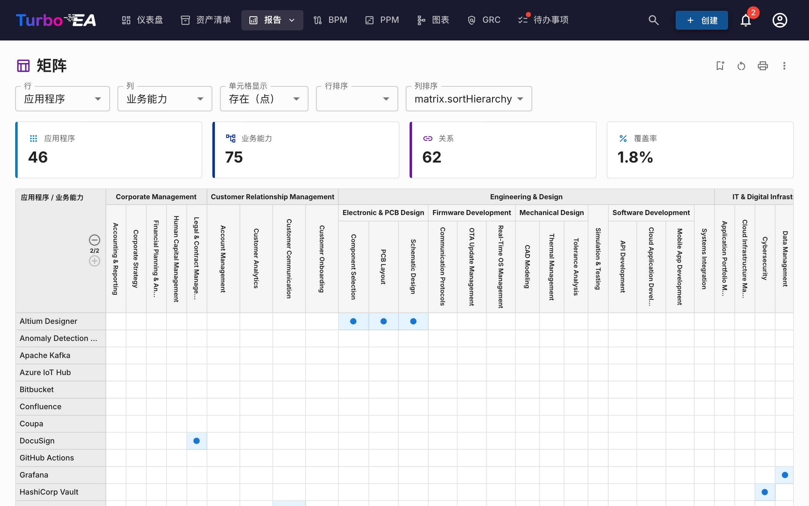

**矩阵报告**创建两种卡片类型之间的**交叉引用网格**。例如：

- **行** —— 应用程序
- **列** —— 业务能力
- **单元格** —— 指示是否存在关系（以及多少个）

这对于识别覆盖空缺（没有支持应用程序的能力）或冗余（由太多应用程序支持的能力）非常有用。

## 数据质量报告

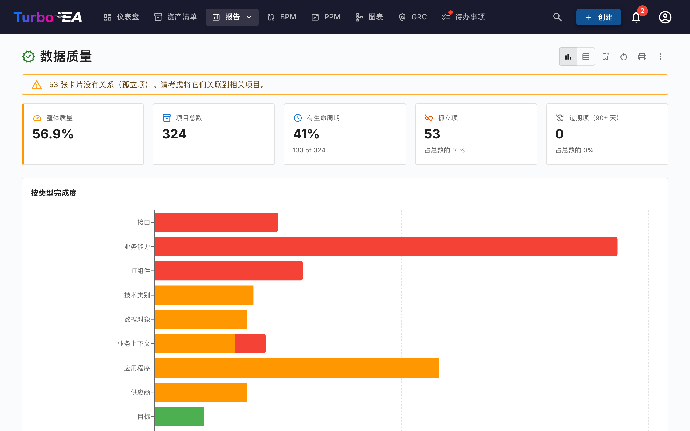

**数据质量报告**是一个**完整度仪表盘**，显示架构数据的填写程度。基于元模型中配置的字段权重：

- **总体评分** —— 所有卡片的平均数据质量
- **按类型** —— 显示哪些卡片类型完整度最好/最差的细分
- **单个卡片** —— 数据质量最低的卡片列表，优先改进

## 生命周期终止（EOL）报告

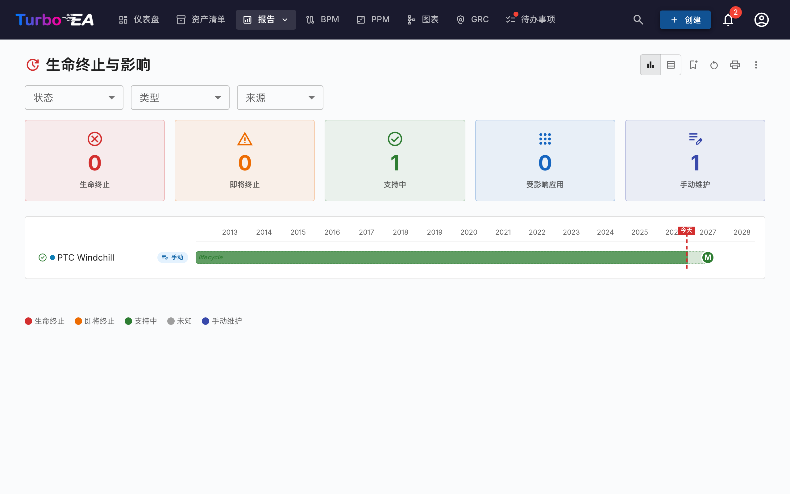

**EOL 报告**显示通过 [EOL 管理](../admin/eol.md)功能链接的技术产品的支持状态：

- **状态分布** —— 多少产品受支持、即将到期或已到期
- **时间线** —— 产品何时将失去支持
- **风险优先级** —— 关注即将到期的关键任务组件

## 已保存报告

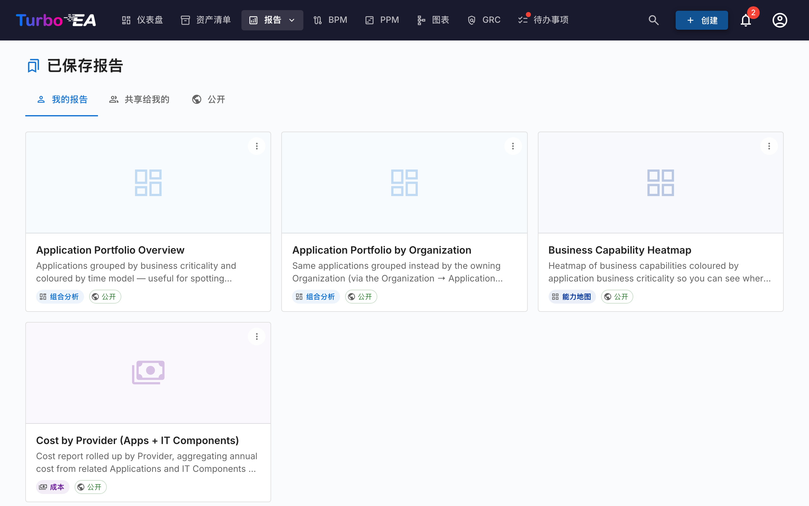

保存任何报告配置以便日后快速访问。已保存的报告包含缩略图预览，可在组织内共享。

## 流程地图

**流程地图**将组织的业务流程架构可视化为结构化地图，显示流程类别（管理、核心、支持）及其层级关系。
