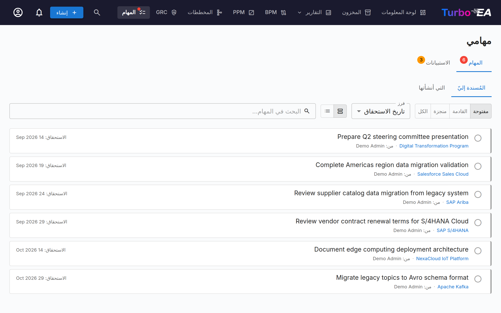

# المهام والاستبيانات

تجمع صفحة **المهام** جميع عناصر العمل المعلّقة في مكان واحد. وهي تحتوي على علامتَي تبويب: **مهامي** و**استبياناتي**.

## مهامي

المهام هي أعمال مُسنَدة إليك أو أنشأتها بنفسك. ويمكن ربطها ببطاقات محدّدة أو أن تكون قائمة بذاتها.

### التصفية والبحث والفرز

**شرائح المصدر** — تحمل كل مهمة مصدرًا يبيّن من أين أتت. عندما تضم قائمتك مهامًا من أكثر من مصدر واحد، تظهر فوقها شرائح تصفية — انقر على شريحة لعرض مهام ذلك المصدر فقط (انقر على عدّة شرائح لدمجها)؛ وتعرض كل شريحة عدّادًا مباشرًا. المصادر هي:

- **مهمة مشروع** — مُزامَنة من لوحة مهام مبادرة PPM
- **خطر** — إسنادات مالك الخطر ودورات مهام التخفيف المتكرّرة من سجلّ مخاطر GRC
- **ADR** / **SoAW** — طلبات توقيع على قرارات العمارة ووثائق Statements of Architecture Work
- **اعتماد العملية** — مراجعات تدفّقات العمليات التي تنتظر تدقيقك (BPM)
- **إضافة** — أُنشئت بواسطة إضافة مثبّتة
- **يدوي** — أُنشئت يدويًا، على بطاقة أو بشكل مستقل

يحمل كل صف أيضًا أيقونة مصدر وشريط تمييز مرمّزَين بالألوان، بحيث تُقرأ القوائم المختلطة بلمحة واحدة. أما المهمة التي نسختها إضافة موصِّلة إلى نظام تتبّع خارجي (Jira، GitLab، …) فتحتفظ بمصدرها الحقيقي وتعرض المرجع الخارجي (مثل *KAN-6*) كرابط صغير — فالنسخة المتطابقة للمرجعية فقط، وتُنجَز المهمة دائمًا في Turbo EA.

**العرض المجمّع** — بشكل افتراضي تُقسَّم القائمة إلى قسم قابل للطي لكل مصدر، بترتيب ثابت. يعرض رأس كل قسم أيقونة المصدر وعدد المهام، و— عندما تكون بعض المهام متأخرة — عدّادًا أحمر، بحيث يظل القسم المطوي يشير إلى الإلحاح. انقر على رأس القسم لطيّه أو فتحه؛ وتُحفَظ الأقسام المطوية. أما مبدّل **تجميع حسب المصدر** / **قائمة بسيطة** بجوار عنصر الفرز فيبدّل إلى قائمة بسيطة واحدة (مفيد للفرز حسب تاريخ الاستحقاق عبر جميع المصادر)؛ ويُحفَظ هذا الاختيار أيضًا. والقائمة التي تشترك جميع مهامها في مصدر واحد تُعرَض بشكل بسيط تلقائيًا.

**الحالة** — استخدم مبدّل الحالة للتصفية:

- **مفتوحة** — مهام لا تزال معلّقة أو قيد التنفيذ
- **قادمة** — التكرارات المستقبلية المجدولة للمهام المتكرّرة التي لم يحِن موعدها بعد
- **منجَزة** — مهام مكتملة
- **الكل** — كل شيء

**الفرز** — رتّب حسب تاريخ الاستحقاق (الأكثر إلحاحًا أولًا) أو الأحدث أولًا أو حسب المصدر. ويُحفَظ اختيارك.

**البحث** — يصفّي مربّع البحث فورًا عبر نص المهمة والبطاقة المرتبطة واسمَي المُسنِد والمُسنَد إليه.

### إدارة المهام

- **تبديل سريع** — انقر على مربّع الاختيار لتعليم مهمة كمنجَزة (أو إعادة فتحها)
- **من أسندها** — في علامة تبويب *المُسنَدة إليّ* تعرض كل مهمة شريحة **من:** تحمل اسم الشخص الذي أسندها؛ وفي *التي أنشأتها* تعرض الشريحة اسم المُسنَد إليه بدلًا من ذلك
- **رابط البطاقة** — إذا كانت المهمة مرتبطة ببطاقة، انقر على اسم البطاقة للانتقال إلى صفحة تفاصيلها
- **مهام النظام** — يُنشئ النظام بعض المهام تلقائيًا (مثل "الردّ على الاستبيان للبطاقة X"). وتتضمّن هذه رابطًا مباشرًا إلى الإجراء ذي الصلة

### إنشاء المهام

يمكنك إنشاء المهام من مكانين:

1. **من هذه الصفحة** — انقر على **+ مهمة جديدة**، وأدخِل عنوانًا، واختياريًا عيّن مُسنَدًا إليه وتاريخ استحقاق ورابطًا إلى بطاقة
2. **من علامة تبويب المهام في بطاقة** — أنشئ مهمة تُربَط تلقائيًا بتلك البطاقة

تتتبّع كل مهمة:

| الحقل | الوصف |
|-------|-------------|
| **العنوان** | ما يجب القيام به |
| **الحالة** | مفتوحة أو منجَزة |
| **المُسنَد إليه** | المستخدم المسؤول |
| **تاريخ الاستحقاق** | موعد نهائي اختياري |
| **البطاقة** | البطاقة المرتبطة (اختياري) |

### المهام المتكرّرة

عند إنشاء مهمة من علامة تبويب **المهام** في بطاقة، فعّل **التكرار** لتحويلها إلى مهمة متكرّرة — مثالي للأنشطة المنتظمة مثل "مراجعة هذه البطاقة كل 6 أشهر". اختر معدّل تكرارها (كل *N* أيام أو أسابيع أو أشهر أو سنوات).

- **الترحيل التلقائي للأمام** — عند تعليم مهمة متكرّرة كمنجَزة، يُنشأ التكرار التالي تلقائيًا مع إزاحة تاريخ استحقاقه بمقدار النسق (مع مراعاة التقويم، بحيث تبقى مراجعة نهاية الشهر في نهاية الشهر).
- **المهلة المسبقة** — يبقى التكرار البعيد المستقبلي **مجدولًا** (مخفيًا من قائمتك المفتوحة، دون إشعار) حتى تُفتَح نافذة مهلته المسبقة، ثم يصبح مهمة مفتوحة عادية ويُشعِر المُسنَد إليه. تأخذ المهلة المسبقة قيمة افتراضية معقولة لكل نسق ويمكن تعديلها.
- **التفعيل المبكر** — انقر على أيقونة الحدث القادم على مهمة مجدولة لتفعيلها على الفور إذا أردت إجراء المراجعة قبل الموعد.

## استبياناتي

تعرض علامة تبويب **الاستبيانات** جميع استبيانات صيانة البيانات التي تحتاج إلى ردّك. تُنشأ الاستبيانات من قِبل المسؤولين لجمع المعلومات من أصحاب المصلحة حول بطاقات محدّدة (راجع [إدارة الاستبيانات](../admin/surveys.md)).

يعرض كل استبيان معلّق:

- اسم الاستبيان والبطاقة المستهدفة
- زر **الردّ** الذي ينتقل إلى نموذج الردّ

يقدّم نموذج الردّ على الاستبيان الأسئلة التي كوّنها المسؤول. وقد تحدّث إجاباتك سمات البطاقة تلقائيًا، اعتمادًا على كيفية تكوين الاستبيان.
