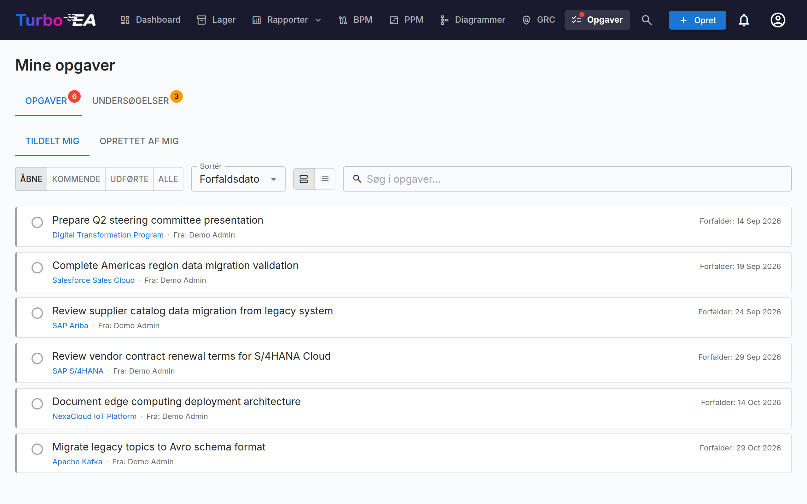

# Opgaver & undersøgelser

**Opgaver**-siden centraliserer alle ventende arbejdsemner på ét sted. Den har to faner: **Mine todos** og **Mine undersøgelser**.

## Mine opgaver

Opgaver er arbejdsemner tildelt dig eller oprettet af dig. De kan være knyttet til specifikke kort eller stå alene.

### Filtrering, søgning og sortering

**Oprindelseschips** — Hver todo bærer en oprindelse: hvor den kom fra. Klik på en chip for kun at vise todos med den oprindelse (klik på flere for at kombinere dem); hver chip viser et live-antal. Oprindelserne er:

- **Projektopgave** — Synkroniseret fra et PPM-initiativs opgavetavle
- **Risiko** — Tildelinger som risikoejer og tilbagevendende afbødningscyklusser fra GRC-risikoregisteret
- **ADR** / **SoAW** — Underskriftsanmodninger på arkitekturbeslutninger og Statements of Architecture Work
- **Procesgodkendelse** — Procesflow-revisioner, der afventer din gennemgang (BPM)
- **Udvidelse** — Spejlet fra et eksternt sporingssystem af en installeret udvidelse
- **Manuel** — Oprettet i hånden, på et kort eller selvstændigt

Hver række bærer desuden et farvekodet oprindelsesbadge og en accentstribe, så blandede lister kan aflæses med et enkelt blik.

**Status** — Brug statusvælgeren til at filtrere:

- **Åbne** — Opgaver, der stadig er afventende eller i gang
- **Kommende** — Planlagte fremtidige forekomster af tilbagevendende opgaver, der endnu ikke er forfaldne
- **Færdige** — Fuldførte opgaver
- **Alle** — Alt

**Sortering** — Sortér efter forfaldsdato (de mest presserende først), nyeste først eller oprindelse. Dit valg huskes.

**Søgning** — Søgefeltet filtrerer øjeblikkeligt på todo-teksten, det tilknyttede kort samt navnene på den, der har tildelt, og modtageren.

### Håndtering af opgaver

- **Hurtig skifter** — Klik på afkrydsningsfeltet for at markere en opgave som færdig (eller genåbne den)
- **Hvem har tildelt den** — På fanen *Tildelt mig* viser hver todo en **Fra:**-chip med navnet på den person, der tildelte den; på *Oprettet af mig* viser chippen i stedet modtageren
- **Kortlink** — Hvis en opgave er knyttet til et kort, klik på kortnavnet for at navigere til dets detaljeside
- **Systemopgaver** — Nogle opgaver genereres automatisk af systemet (f.eks. "Besvar undersøgelse for kort X"). Disse inkluderer et direkte link til den relevante handling

### Oprettelse af opgaver

Du kan oprette opgaver fra to steder:

1. **Fra denne side** — Klik på **+ Ny opgave**, indtast en titel, og indstil eventuelt en modtager, forfaldsdato og link til et kort
2. **Fra et korts Opgaver-fane** — Opret en opgave, der automatisk er knyttet til det kort

Hver opgave sporer:

| Felt | Beskrivelse |
|-------|-------------|
| **Titel** | Hvad der skal gøres |
| **Status** | Åben eller færdig |
| **Modtager** | Den bruger, der er ansvarlig |
| **Forfaldsdato** | Valgfri deadline |
| **Kort** | Det tilknyttede kort (valgfrit) |

### Tilbagevendende opgaver

Når du opretter en opgave fra et korts **Todos**-fane, kan du slå **Gentag** til for at gøre den tilbagevendende — ideelt til regelmæssige aktiviteter som «få dette kort gennemgået hver 6. måned». Vælg, hvor ofte den gentages (hver *N* dage, uger, måneder eller år).

- **Automatisk fremrulning** — Når du markerer en tilbagevendende opgave som færdig, oprettes den næste forekomst automatisk med forfaldsdatoen forskudt efter kadencen (kalenderkorrekt, så en gennemgang ved månedens udgang forbliver ved månedens udgang).
- **Varslingstid** — En fjern fremtidig forekomst forbliver **Planlagt** (skjult fra din liste over åbne, uden notifikation), indtil dens varslingsvindue åbner; derefter bliver den til en normal åben opgave og giver den ansvarlige besked. Varslingstiden har fornuftige standardværdier pr. kadence og kan justeres.
- **Aktivér tidligt** — Klik på ikonet for kommende begivenhed på en planlagt opgave for at aktivere den med det samme, hvis du vil foretage gennemgangen før tid.

## Mine undersøgelser

Fanen **Undersøgelser** viser alle datavedligeholdelsesundersøgelser, der kræver dit svar. Undersøgelser oprettes af administratorer for at indsamle information fra interessenter om specifikke kort (se [Undersøgelsesadministration](../admin/surveys.md)).

Hver afventende undersøgelse viser:

- Undersøgelsesnavnet og målkortet
- En **Besvar**-knap, der navigerer til svarformularen

Svarformularen til undersøgelsen præsenterer spørgsmål konfigureret af administratoren. Dine svar kan automatisk opdatere kortattributter, afhængigt af hvordan undersøgelsen blev konfigureret.
