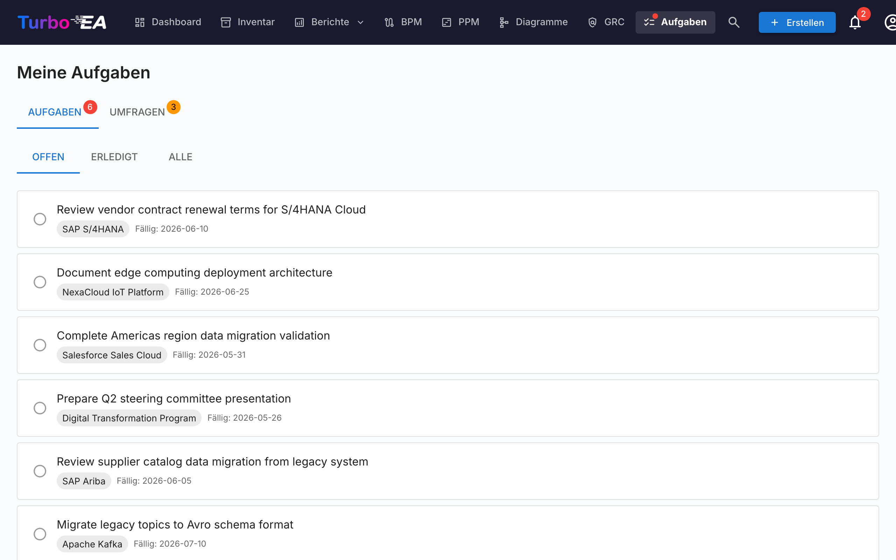

# Aufgaben & Umfragen

Die **Aufgaben**-Seite zentralisiert alle anstehenden Arbeitselemente an einem Ort. Sie hat zwei Tabs: **Meine Aufgaben** und **Meine Umfragen**.

## Meine Aufgaben

Aufgaben sind Ihnen zugewiesene oder von Ihnen erstellte Tasks. Sie können mit bestimmten Karten verknüpft oder eigenständig sein.

### Filtern

Verwenden Sie die Status-Tabs zum Filtern:

- **Offen** — Noch ausstehende oder in Bearbeitung befindliche Aufgaben
- **Erledigt** — Abgeschlossene Aufgaben
- **Alle** — Alles

### Aufgaben verwalten

- **Schnelles Umschalten** — Klicken Sie auf die Checkbox, um eine Aufgabe als erledigt zu markieren (oder sie wieder zu öffnen)
- **Kartenverknüpfung** — Wenn eine Aufgabe mit einer Karte verknüpft ist, klicken Sie auf den Kartennamen, um zur Detailseite zu navigieren
- **Systemaufgaben** — Einige Aufgaben werden vom System automatisch generiert (z.B. «Umfrage für Karte X beantworten»). Diese enthalten einen direkten Link zur relevanten Aktion

### Aufgaben erstellen

Sie können Aufgaben von zwei Stellen aus erstellen:

1. **Von dieser Seite** — Klicken Sie auf **+ Neue Aufgabe**, geben Sie einen Titel ein und setzen Sie optional einen Beauftragten, ein Fälligkeitsdatum und eine Verknüpfung zu einer Karte
2. **Vom Aufgaben-Tab einer Karte** — Erstellen Sie eine Aufgabe, die automatisch mit dieser Karte verknüpft wird

Jede Aufgabe erfasst:

| Feld | Beschreibung |
|------|-------------|
| **Titel** | Was erledigt werden muss |
| **Status** | Offen oder Erledigt |
| **Beauftragter** | Der verantwortliche Benutzer |
| **Fälligkeitsdatum** | Optionale Frist |
| **Karte** | Die verknüpfte Karte (optional) |

### Wiederkehrende Todos

Beim Erstellen eines Todos auf dem **Todos**-Tab einer Karte können Sie **Wiederholen** aktivieren, um ein wiederkehrendes Todo zu erstellen — ideal für regelmäßige Tätigkeiten wie «diese Karte alle 6 Monate überprüfen lassen». Legen Sie fest, wie oft es sich wiederholt (alle *N* Tage, Wochen, Monate oder Jahre).

- **Automatische Fortschreibung** — Wenn Sie ein wiederkehrendes Todo als erledigt markieren, wird das nächste Vorkommen automatisch mit einem um das Intervall verschobenen Fälligkeitsdatum erstellt (kalendergenau, sodass eine Monatsend-Überprüfung am Monatsende bleibt).
- **Vorlaufzeit** — Ein weit in der Zukunft liegendes Vorkommen bleibt **Geplant** (aus Ihrer offenen Liste ausgeblendet, ohne Benachrichtigung), bis sich sein Vorlaufzeitfenster öffnet; dann wird es zu einem normalen offenen Todo und benachrichtigt den Zuständigen. Die Vorlaufzeit hat sinnvolle Standardwerte je Intervall und kann angepasst werden.
- **Früher aktivieren** — Klicken Sie auf das Symbol für anstehende Termine bei einem geplanten Todo, um es sofort zu aktivieren, wenn Sie die Überprüfung vorziehen möchten.

## Meine Umfragen

Der **Umfragen**-Tab zeigt alle Datenpflege-Umfragen, die Ihre Antwort erfordern. Umfragen werden von Administratoren erstellt, um strukturierte Informationen von Stakeholdern über bestimmte Karten zu sammeln (siehe [Umfragenverwaltung](../admin/surveys.md)).

Jede ausstehende Umfrage zeigt:

- Den Umfragenamen und die Zielkarte
- Eine **Antworten**-Schaltfläche, die zum Antwortformular navigiert

Das Umfrageantwortformular präsentiert die vom Administrator konfigurierten Fragen. Ihre Antworten können Kartenattribute automatisch aktualisieren, je nachdem wie die Umfrage konfiguriert wurde.
