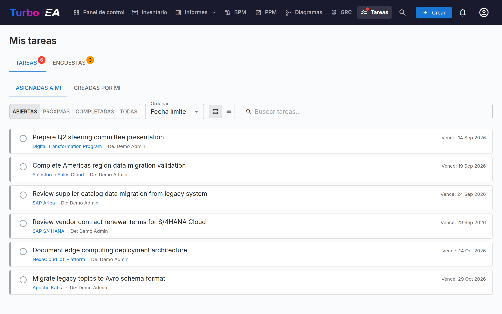

# Tareas y Encuestas

La página de **Tareas** centraliza todos los elementos de trabajo pendientes en un solo lugar. Tiene dos pestañas: **Mis Tareas** y **Mis Encuestas**.

## Mis Tareas

Las tareas son actividades asignadas a usted o creadas por usted. Pueden estar vinculadas a fichas específicas o ser independientes.

### Filtrado, búsqueda y ordenación

**Chips de origen** — Cada tarea lleva un origen: de dónde proviene. Cuando su lista mezcla tareas de más de un origen, aparecen chips de filtrado encima — haga clic en un chip para mostrar solo las tareas de ese origen (haga clic en varios para combinarlos); cada chip muestra un contador en vivo. Los orígenes son:

- **Tarea de proyecto** — Sincronizada desde el tablero de tareas de una iniciativa PPM
- **Riesgo** — Asignaciones como propietario de riesgo y ciclos recurrentes de tareas de mitigación del Registro de Riesgos de GRC
- **ADR** / **SoAW** — Solicitudes de firma sobre decisiones de arquitectura y Statements of Architecture Work
- **Aprobación de proceso** — Revisiones de flujos de proceso en espera de su revisión (BPM)
- **Extensión** — Creada por una extensión instalada
- **Manual** — Creada a mano, en una ficha o de forma independiente

Cada fila lleva además un icono de origen y una franja de acento codificados por color, de modo que las listas mixtas se leen de un vistazo. Una tarea que una extensión conectora ha reflejado en un sistema de seguimiento externo (Jira, GitLab, …) conserva su origen real y muestra la referencia externa (p. ej., *KAN-6*) como un pequeño enlace — el reflejo es solo de referencia, y la tarea siempre se completa en Turbo EA.

**Estado** — Use el selector de estado para filtrar:

- **Abiertas** — Tareas aún pendientes o en progreso
- **Próximas** — Repeticiones futuras programadas de tareas recurrentes que aún no vencen
- **Completadas** — Tareas finalizadas
- **Todas** — Todo

**Ordenar** — Ordene por fecha de vencimiento (las más urgentes primero), las más recientes primero, o por origen. Su elección se recuerda.

**Buscar** — El cuadro de búsqueda filtra al instante por el texto de la tarea, la ficha vinculada y los nombres de quien asigna y del asignado.

### Gestión de Tareas

- **Cambio rápido** — Haga clic en la casilla de verificación para marcar una tarea como completada (o reabrirla)
- **Quién la asignó** — En la pestaña *Asignadas a mí*, cada tarea muestra un chip **De:** con el nombre de la persona que la asignó; en *Creadas por mí* el chip nombra en su lugar al asignado
- **Enlace a ficha** — Si una tarea está vinculada a una ficha, haga clic en el nombre de la ficha para navegar a su página de detalle
- **Tareas del sistema** — Algunas tareas son generadas automáticamente por el sistema (ej., «Responder a encuesta para Ficha X»). Estas incluyen un enlace directo a la acción relevante

### Crear Tareas

Puede crear tareas desde dos lugares:

1. **Desde esta página** — Haga clic en **+ Nueva Tarea**, ingrese un título, opcionalmente establezca un asignado, fecha de vencimiento y vincule a una ficha
2. **Desde la pestaña Tareas de una ficha** — Cree una tarea que se vincula automáticamente a esa ficha

Cada tarea registra:

| Campo | Descripción |
|-------|-------------|
| **Título** | Lo que necesita hacerse |
| **Estado** | Abierta o Completada |
| **Asignado** | El usuario responsable |
| **Fecha de vencimiento** | Fecha límite opcional |
| **Ficha** | La ficha vinculada (opcional) |

### Tareas recurrentes

Al crear una tarea desde la pestaña **Todos** de una ficha, active **Repetir** para convertirla en una tarea recurrente — ideal para actividades regulares como «revisar esta ficha cada 6 meses». Elija con qué frecuencia se repite (cada *N* días, semanas, meses o años).

- **Avance automático** — Cuando marca una tarea recurrente como completada, la siguiente repetición se crea automáticamente con su fecha de vencimiento desplazada según la cadencia (correcta en el calendario, de modo que una revisión de fin de mes se mantiene a fin de mes).
- **Tiempo de anticipación** — Una repetición lejana permanece **Programada** (oculta de su lista de abiertas, sin notificación) hasta que se abre su ventana de anticipación; entonces se convierte en una tarea abierta normal y notifica al responsable. El tiempo de anticipación tiene valores por defecto sensatos según la cadencia y se puede ajustar.
- **Activar antes** — Haga clic en el icono de evento próximo de una tarea programada para activarla de inmediato si desea hacer la revisión con antelación.

## Mis Encuestas

La pestaña **Encuestas** muestra todas las encuestas de mantenimiento de datos que necesitan su respuesta. Las encuestas son creadas por administradores para recopilar información de las partes interesadas sobre fichas específicas (ver [Administración de Encuestas](../admin/surveys.es.md)).

Cada encuesta pendiente muestra:

- El nombre de la encuesta y la ficha objetivo
- Un botón **Responder** que navega al formulario de respuesta

El formulario de respuesta presenta preguntas configuradas por el administrador. Sus respuestas pueden actualizar automáticamente los atributos de la ficha, dependiendo de cómo se configuró la encuesta.
