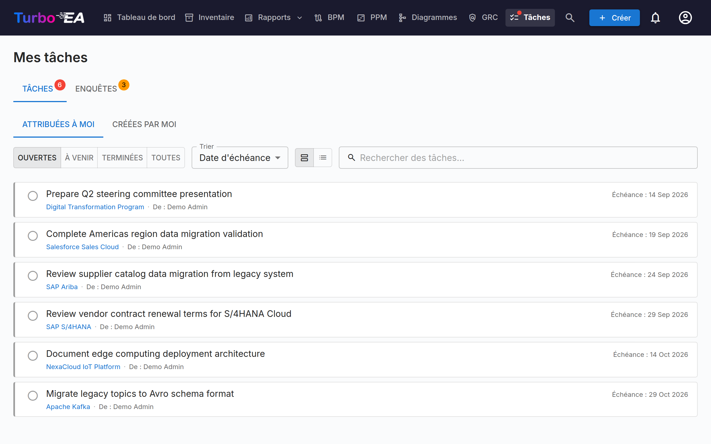

# Tâches et enquêtes

La page **Tâches** centralise tous les éléments de travail en attente en un seul endroit. Elle comporte deux onglets : **Mes tâches** et **Mes enquêtes**.

## Mes tâches

Les tâches sont des éléments qui vous sont assignés ou que vous avez créés. Elles peuvent être liées à des fiches spécifiques ou être autonomes.

### Filtrage, recherche et tri

**Puces d'origine** -- Chaque tâche porte une origine : d'où elle provient. Lorsque votre liste mélange des tâches de plusieurs origines, des puces de filtrage apparaissent au-dessus -- cliquez sur une puce pour n'afficher que les tâches de cette origine (cliquez sur plusieurs puces pour les combiner) ; chaque puce affiche un compteur en direct. Les origines sont :

- **Tâche projet** -- Synchronisée depuis le tableau des tâches d'une initiative PPM
- **Risque** -- Affectations en tant que responsable de risque et cycles récurrents de tâches d'atténuation du registre des risques GRC
- **ADR** / **SoAW** -- Demandes de signature sur des décisions d'architecture et des Statements of Architecture Work
- **Approbation de processus** -- Révisions de flux de processus en attente de votre relecture (BPM)
- **Extension** -- Créée par une extension installée
- **Manuelle** -- Créée à la main, sur une fiche ou de façon autonome

Chaque ligne porte également une icône d'origine et une bande d'accent codées par couleur, de sorte que les listes mixtes se lisent d'un coup d'œil. Une tâche qu'une extension connecteur a reflétée vers un outil de suivi externe (Jira, GitLab, …) conserve son origine réelle et affiche la référence externe (p. ex. *KAN-6*) sous la forme d'un petit lien -- le miroir n'est là qu'à titre de référence, et la tâche se termine toujours dans Turbo EA.

**Statut** -- Utilisez le sélecteur de statut pour filtrer :

- **Ouvert** -- Tâches encore en attente ou en cours
- **À venir** -- Occurrences futures planifiées de tâches récurrentes pas encore dues
- **Terminé** -- Tâches terminées
- **Tout** -- Tout afficher

**Tri** -- Triez par date d'échéance (les plus urgentes d'abord), les plus récentes d'abord, ou par origine. Votre choix est mémorisé.

**Recherche** -- Le champ de recherche filtre instantanément sur le texte de la tâche, la fiche liée et les noms de l'assignateur et du responsable.

### Gestion des tâches

- **Bascule rapide** -- Cliquez sur la case à cocher pour marquer une tâche comme terminée (ou la réouvrir)
- **Qui l'a assignée** -- Sur l'onglet *Assignées à moi*, chaque tâche affiche une puce **De :** nommant la personne qui l'a assignée ; sur *Créées par moi*, la puce nomme à la place le responsable
- **Lien vers la fiche** -- Si une tâche est liée à une fiche, cliquez sur le nom de la fiche pour naviguer vers sa page de détail
- **Tâches système** -- Certaines tâches sont générées automatiquement par le système (par ex. « Répondre à l'enquête pour la fiche X »). Celles-ci incluent un lien direct vers l'action correspondante

### Création de tâches

Vous pouvez créer des tâches depuis deux endroits :

1. **Depuis cette page** -- Cliquez sur **+ Nouvelle tâche**, entrez un titre, définissez optionnellement un responsable, une date d'échéance et un lien vers une fiche
2. **Depuis l'onglet Tâches d'une fiche** -- Créez une tâche automatiquement liée à cette fiche

Chaque tâche suit :

| Champ | Description |
|-------|-------------|
| **Titre** | Ce qui doit être fait |
| **Statut** | Ouvert ou Terminé |
| **Responsable** | L'utilisateur responsable |
| **Date d'échéance** | Délai optionnel |
| **Fiche** | La fiche liée (optionnel) |

### Tâches récurrentes

Lors de la création d'une tâche depuis l'onglet **Tâches** d'une fiche, activez **Répéter** pour en faire une tâche récurrente — idéal pour les activités régulières comme « faire réviser cette fiche tous les 6 mois ». Choisissez la fréquence de répétition (tous les *N* jours, semaines, mois ou années).

- **Report automatique** — Lorsque vous marquez une tâche récurrente comme terminée, la prochaine occurrence est créée automatiquement avec une date d'échéance décalée selon la cadence (calendaire, de sorte qu'une révision de fin de mois reste en fin de mois).
- **Délai d'anticipation** — Une occurrence lointaine reste **Planifiée** (masquée de votre liste ouverte, sans notification) jusqu'à l'ouverture de sa fenêtre d'anticipation ; elle devient alors une tâche ouverte normale et notifie le responsable. Le délai a des valeurs par défaut pertinentes selon la cadence et peut être ajusté.
- **Activer en avance** — Cliquez sur l'icône d'événement à venir d'une tâche planifiée pour l'activer immédiatement si vous souhaitez effectuer la révision en avance.

## Mes enquêtes

L'onglet **Enquêtes** affiche toutes les enquêtes de maintenance de données nécessitant votre réponse. Les enquêtes sont créées par les administrateurs pour collecter des informations auprès des parties prenantes sur des fiches spécifiques (voir [Administration des enquêtes](../admin/surveys.md)).

Chaque enquête en attente affiche :

- Le nom de l'enquête et la fiche cible
- Un bouton **Répondre** qui redirige vers le formulaire de réponse

Le formulaire de réponse à l'enquête présente les questions configurées par l'administrateur. Vos réponses peuvent automatiquement mettre à jour les attributs de la fiche, selon la configuration de l'enquête.
