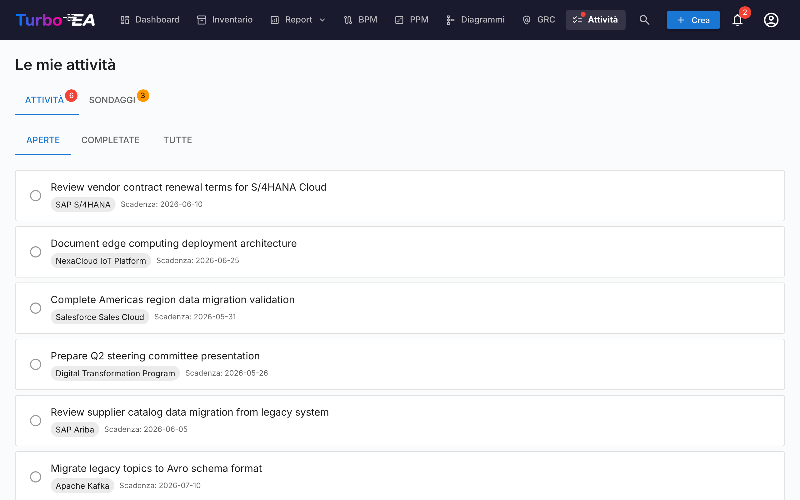

# Attività e sondaggi

La pagina **Attività** centralizza tutti gli elementi di lavoro in sospeso in un unico luogo. Ha due schede: **I miei todo** e **I miei sondaggi**.

## I miei todo

I todo sono attività assegnate a voi o da voi create. Possono essere collegati a card specifiche o autonomi.

### Filtri

Utilizzate le schede di stato per filtrare:

- **Aperti** — Attività ancora in sospeso o in corso
- **Completati** — Attività completate
- **Tutti** — Tutto

### Gestione dei todo

- **Toggle rapido** — Cliccate sulla casella di controllo per segnare un todo come completato (o riaprirlo)
- **Link alla card** — Se un todo è collegato a una card, cliccate sul nome della card per navigare alla sua pagina di dettaglio
- **Todo di sistema** — Alcuni todo sono generati automaticamente dal sistema (es. "Rispondi al sondaggio per Card X"). Questi includono un link diretto all'azione pertinente

### Creazione di todo

Potete creare todo da due posizioni:

1. **Da questa pagina** — Cliccate su **+ Nuovo todo**, inserite un titolo, opzionalmente impostate un assegnatario, una data di scadenza e un collegamento a una card
2. **Dalla scheda Todo di una card** — Create un todo che viene automaticamente collegato a quella card

Ogni todo traccia:

| Campo | Descrizione |
|-------|-------------|
| **Titolo** | Cosa deve essere fatto |
| **Stato** | Aperto o Completato |
| **Assegnatario** | L'utente responsabile |
| **Data di scadenza** | Scadenza opzionale |
| **Card** | La card collegata (opzionale) |

### Todo ricorrenti

Quando crei un todo dalla scheda **Todo** di una card, attiva **Ripeti** per renderlo ricorrente — ideale per attività regolari come «far revisionare questa card ogni 6 mesi». Scegli ogni quanto si ripete (ogni *N* giorni, settimane, mesi o anni).

- **Avanzamento automatico** — Quando contrassegni un todo ricorrente come completato, la prossima occorrenza viene creata automaticamente con la data di scadenza spostata in base alla cadenza (corretta sul calendario, così una revisione di fine mese resta a fine mese).
- **Tempo di anticipo** — Un'occorrenza lontana resta **Pianificata** (nascosta dall'elenco aperto, senza notifica) finché non si apre la sua finestra di anticipo; poi diventa un normale todo aperto e notifica il responsabile. Il tempo di anticipo ha valori predefiniti sensati per cadenza ed è regolabile.
- **Attiva in anticipo** — Clicca sull'icona dell'evento imminente di un todo pianificato per attivarlo subito se vuoi fare la revisione in anticipo.

## I miei sondaggi

La scheda **Sondaggi** mostra tutti i sondaggi di manutenzione dati che necessitano della vostra risposta. I sondaggi sono creati dagli amministratori per raccogliere informazioni dagli stakeholder su card specifiche (vedi [Amministrazione sondaggi](../admin/surveys.md)).

Ogni sondaggio in attesa mostra:

- Il nome del sondaggio e la card target
- Un pulsante **Rispondi** che naviga al modulo di risposta

Il modulo di risposta al sondaggio presenta domande configurate dall'amministratore. Le vostre risposte possono aggiornare automaticamente gli attributi della card, a seconda di come il sondaggio è stato configurato.
