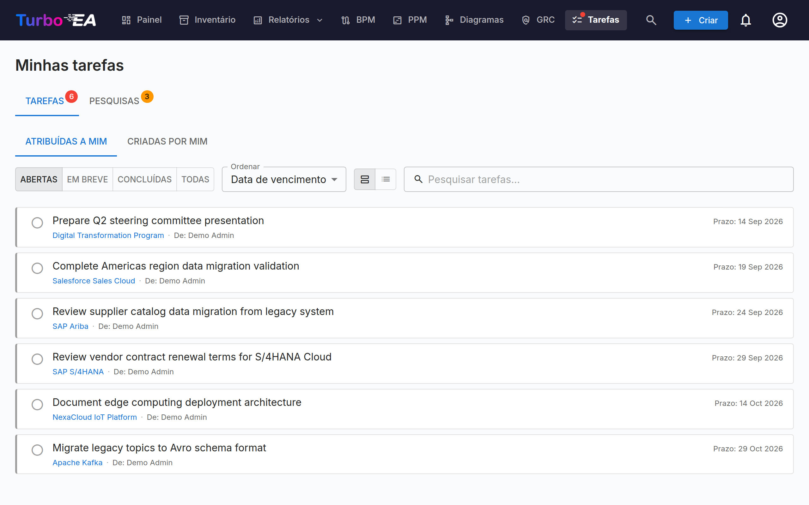

# Tarefas e Pesquisas

A página de **Tarefas** centraliza todos os itens de trabalho pendentes em um único lugar. Ela tem duas abas: **Minhas Tarefas** e **Minhas Pesquisas**.

## Minhas Tarefas

Tarefas são itens atribuídos a você ou criados por você. Elas podem estar vinculadas a cards específicos ou serem independentes.

### Filtragem, busca e ordenação

**Chips de origem** — Cada tarefa carrega uma origem: de onde ela veio. Quando sua lista mistura tarefas de mais de uma origem, chips de filtro aparecem acima dela — clique em um chip para mostrar apenas as tarefas daquela origem (clique em vários para combiná-los); cada chip exibe uma contagem em tempo real. As origens são:

- **Tarefa de projeto** — Sincronizada do quadro de tarefas de uma iniciativa PPM
- **Risco** — Atribuições como responsável por risco e ciclos recorrentes de tarefas de mitigação do Registro de Riscos do GRC
- **ADR** / **SoAW** — Solicitações de assinatura em decisões de arquitetura e Statements of Architecture Work
- **Aprovação de processo** — Revisões de fluxo de processo aguardando sua análise (BPM)
- **Extensão** — Criada por uma extensão instalada
- **Manual** — Criada à mão, em um card ou de forma independente

Cada linha também carrega um ícone de origem e uma faixa de destaque codificados por cor, de modo que listas mistas se leem num relance. Uma tarefa que uma extensão conectora espelhou em um rastreador externo (Jira, GitLab, …) mantém sua origem real e mostra a referência externa (por exemplo, *KAN-6*) como um pequeno link — o espelhamento é apenas para referência, e a tarefa é sempre concluída no Turbo EA.

**Status** — Use o seletor de status para filtrar:

- **Abertas** — Tarefas ainda pendentes ou em andamento
- **Em breve** — Ocorrências futuras agendadas de tarefas recorrentes ainda não vencidas
- **Concluídas** — Tarefas completadas
- **Todas** — Tudo

**Ordenação** — Ordene por data de vencimento (as mais urgentes primeiro), as mais recentes primeiro, ou por origem. Sua escolha é lembrada.

**Busca** — A caixa de busca filtra instantaneamente pelo texto da tarefa, pelo card vinculado e pelos nomes de quem atribuiu e do responsável.

### Gerenciando Tarefas

- **Alternância rápida** — Clique na caixa de seleção para marcar uma tarefa como concluída (ou reabri-la)
- **Quem atribuiu** — Na aba *Atribuídas a mim*, cada tarefa mostra um chip **De:** com o nome da pessoa que a atribuiu; em *Criadas por mim* o chip nomeia o responsável em vez disso
- **Link do card** — Se uma tarefa está vinculada a um card, clique no nome do card para navegar até sua página de detalhe
- **Tarefas do sistema** — Algumas tarefas são geradas automaticamente pelo sistema (ex.: "Responder pesquisa para Card X"). Estas incluem um link direto para a ação relevante

### Criando Tarefas

Você pode criar tarefas a partir de dois lugares:

1. **Desta página** — Clique em **+ Nova Tarefa**, insira um título, opcionalmente defina um responsável, data de vencimento e vincule a um card
2. **Da aba de Tarefas de um card** — Crie uma tarefa que é automaticamente vinculada àquele card

Cada tarefa rastreia:

| Campo | Descrição |
|-------|-----------|
| **Título** | O que precisa ser feito |
| **Status** | Aberto ou Concluído |
| **Responsável** | O usuário responsável |
| **Data de vencimento** | Prazo opcional |
| **Card** | O card vinculado (opcional) |

### Tarefas recorrentes

Ao criar uma tarefa na aba **Todos** de um card, ative **Repetir** para torná-la recorrente — ideal para atividades regulares como «revisar este card a cada 6 meses». Escolha com que frequência ela se repete (a cada *N* dias, semanas, meses ou anos).

- **Avanço automático** — Quando você marca uma tarefa recorrente como concluída, a próxima ocorrência é criada automaticamente com a data de vencimento deslocada conforme a cadência (correta no calendário, de modo que uma revisão de fim de mês permanece no fim do mês).
- **Tempo de antecedência** — Uma ocorrência distante permanece **Agendada** (oculta da sua lista de abertas, sem notificação) até que sua janela de antecedência se abra; então torna-se uma tarefa aberta normal e notifica o responsável. O tempo de antecedência tem padrões sensatos por cadência e pode ser ajustado.
- **Ativar antecipadamente** — Clique no ícone de evento futuro de uma tarefa agendada para ativá-la imediatamente se quiser fazer a revisão antes do prazo.

## Minhas Pesquisas

A aba de **Pesquisas** mostra todas as pesquisas de manutenção de dados que precisam da sua resposta. Pesquisas são criadas por administradores para coletar informações de partes interessadas sobre cards específicos (veja [Administração de Pesquisas](../admin/surveys.md)).

Cada pesquisa pendente mostra:

- O nome da pesquisa e o card alvo
- Um botão **Responder** que navega até o formulário de resposta

O formulário de resposta da pesquisa apresenta perguntas configuradas pelo administrador. Suas respostas podem atualizar automaticamente atributos do card, dependendo de como a pesquisa foi configurada.
