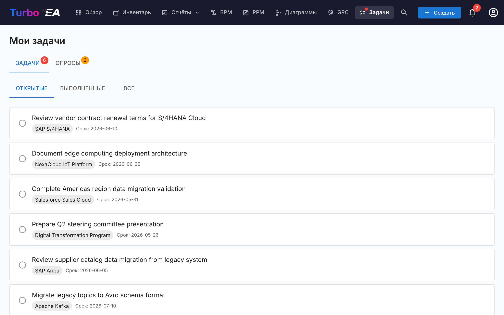

# Задачи и опросы

Страница **Задачи** централизует все ожидающие рабочие элементы в одном месте. Она содержит две вкладки: **Мои задачи** и **Мои опросы**.

## Мои задачи

Задачи — это работы, назначенные вам или созданные вами. Они могут быть привязаны к конкретным карточкам или быть самостоятельными.

### Фильтрация

Используйте вкладки статусов для фильтрации:

- **Открытые** — задачи, ещё ожидающие выполнения или в процессе
- **Выполненные** — завершённые задачи
- **Все** — все задачи

### Управление задачами

- **Быстрое переключение** — нажмите на флажок, чтобы отметить задачу как выполненную (или вернуть в работу)
- **Ссылка на карточку** — если задача привязана к карточке, нажмите на название карточки, чтобы перейти к её деталям
- **Системные задачи** — некоторые задачи создаются системой автоматически (например, «Ответить на опрос для карточки X»). Они содержат прямую ссылку на соответствующее действие

### Создание задач

Задачи можно создавать из двух мест:

1. **С этой страницы** — нажмите **+ Новая задача**, введите заголовок, при необходимости укажите исполнителя, срок выполнения и привязку к карточке
2. **С вкладки «Задачи» карточки** — создайте задачу, которая автоматически привязывается к этой карточке

Каждая задача отслеживает:

| Поле | Описание |
|------|----------|
| **Заголовок** | Что нужно сделать |
| **Статус** | Открыта или Выполнена |
| **Исполнитель** | Ответственный пользователь |
| **Срок выполнения** | Необязательный крайний срок |
| **Карточка** | Привязанная карточка (необязательно) |

### Повторяющиеся задачи

При создании задачи на вкладке **Задачи** карточки включите **Повторять**, чтобы сделать её повторяющейся — идеально для регулярных действий вроде «проверять эту карточку каждые 6 месяцев». Выберите частоту повторения (каждые *N* дней, недель, месяцев или лет).

- **Автоматический перенос** — Когда вы отмечаете повторяющуюся задачу выполненной, следующее вхождение создаётся автоматически со сроком, смещённым на интервал (с учётом календаря, поэтому проверка в конце месяца остаётся в конце месяца).
- **Время упреждения** — Далёкое вхождение остаётся **Запланированным** (скрыто из списка открытых, без уведомления), пока не откроется окно упреждения; затем оно становится обычной открытой задачей и уведомляет ответственного. Время упреждения имеет разумные значения по умолчанию для каждой частоты и может быть изменено.
- **Активировать заранее** — Нажмите значок предстоящего события на запланированной задаче, чтобы активировать её немедленно, если хотите провести проверку раньше срока.

## Мои опросы

Вкладка **Опросы** показывает все опросы по поддержанию данных, требующие вашего ответа. Опросы создаются администраторами для сбора информации от заинтересованных сторон о конкретных карточках (см. [Администрирование опросов](../admin/surveys.md)).

Каждый ожидающий опрос показывает:

- Название опроса и целевую карточку
- Кнопку **Ответить**, которая ведёт к форме ответа

Форма ответа на опрос представляет вопросы, настроенные администратором. Ваши ответы могут автоматически обновлять атрибуты карточки, в зависимости от настроек опроса.
