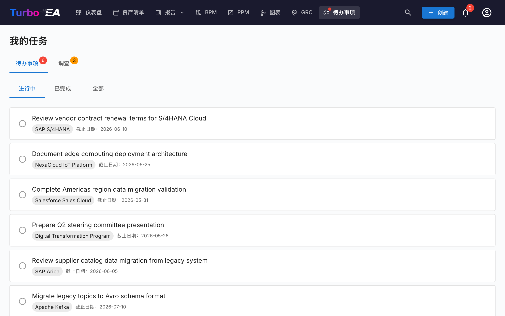

# 任务和问卷

**任务**页面将所有待处理的工作项集中在一个地方。它有两个标签页：**我的待办**和**我的问卷**。

## 我的待办

待办事项是分配给您或由您创建的任务。它们可以链接到特定卡片或独立存在。

### 筛选

使用状态标签页进行筛选：

- **进行中** —— 仍待处理或进行中的任务
- **已完成** —— 已完成的任务
- **全部** —— 所有任务

### 管理待办

- **快速切换** —— 点击复选框将待办标记为已完成（或重新打开）
- **卡片链接** —— 如果待办链接到卡片，点击卡片名称可导航到其详情页面
- **系统待办** —— 某些待办由系统自动生成（例如「回复卡片 X 的问卷」）。这些包含指向相关操作的直接链接

### 创建待办

您可以从两个地方创建待办：

1. **从此页面** —— 点击 **+ 新建待办**，输入标题，可选设置负责人、截止日期和关联卡片
2. **从卡片的待办标签页** —— 创建自动链接到该卡片的待办

每个待办跟踪：

| 字段 | 描述 |
|------|------|
| **标题** | 需要完成的工作 |
| **状态** | 进行中或已完成 |
| **负责人** | 负责的用户 |
| **截止日期** | 可选的截止时间 |
| **卡片** | 关联的卡片（可选） |

### 周期性待办

在卡片的**待办**标签页创建待办时，打开**重复**即可将其设为周期性待办——非常适合「每 6 个月审核此卡片」等定期活动。选择重复的频率（每 *N* 天、周、月或年）。

- **自动顺延** — 将周期性待办标记为已完成后，系统会按节奏自动创建下一次待办，并相应顺延截止日期（按日历精确计算，因此月末审核会保持在月末）。
- **提前期** — 较远的未来待办会保持**已排程**状态（从您的进行中列表隐藏，且不发送通知），直到其提前期窗口开启；随后变为正常的进行中待办并通知负责人。提前期按节奏提供合理默认值，并可调整。
- **提前激活** — 如果想提前进行审核，点击已排程待办上的即将到来事件图标即可立即激活它。

## 我的问卷

**问卷**标签页显示所有需要您回复的数据维护问卷。问卷由管理员创建，用于从干系人那里收集有关特定卡片的信息（参见[问卷管理](../admin/surveys.md)）。

每个待回复的问卷显示：

- 问卷名称和目标卡片
- 一个**回复**按钮，导航到回复表单

问卷回复表单显示管理员配置的问题。您的回答可能会自动更新卡片属性，具体取决于问卷的配置方式。
