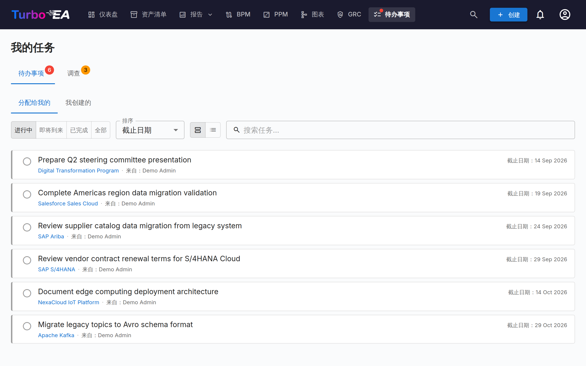

# 任务和问卷

**任务**页面将所有待处理的工作项集中在一个地方。它有两个标签页：**我的待办**和**我的问卷**。

## 我的待办

待办事项是分配给您或由您创建的任务。它们可以链接到特定卡片或独立存在。

### 筛选、搜索和排序

**来源标签** —— 每个待办都带有一个来源，标明它从何而来。当列表混合了来自多个来源的任务时，上方会出现筛选标签——点击某个来源标签即可只显示该来源的待办（点击多个可组合筛选）；每个标签实时显示数量。来源包括：

- **项目任务** —— 从 PPM 举措的任务看板同步而来
- **风险** —— 来自 GRC 风险登记册的风险负责人分配和周期性缓解任务
- **ADR** / **SoAW** —— 架构决策和 Statements of Architecture Work 的签署请求
- **流程审批** —— 等待您审核的流程图修订版本（BPM）
- **扩展** —— 由已安装的扩展创建
- **手动** —— 手工创建，可关联卡片或独立存在

每行还带有按颜色编码的来源图标和强调色条，让混合列表一目了然。若某个任务已被连接器扩展镜像到外部跟踪系统（Jira、GitLab 等），它仍保留其真实来源，并以小链接形式显示外部编号（如 *KAN-6*）——镜像仅供参考，任务始终在 Turbo EA 中完成。有关 Jira 连接器，请参阅 [Jira Todo Sync](../extensions/jira-todos.md)。

**分组视图** —— 默认情况下，列表会按来源分成若干可折叠的分区，顺序固定。每个分区标题显示来源图标、任务数量，以及——当有任务逾期时——一个红色计数，因此即使分区处于折叠状态也能提示紧迫性。点击标题可折叠或展开分区；折叠状态会被记住。排序控件旁的「按来源分组」/「平铺列表」切换按钮可切换为单一平铺列表（便于跨所有来源按截止日期进行梳理）；该选择同样会被记住。当列表中所有任务来自同一来源时，会自动以平铺方式显示。

**状态** —— 使用状态切换按钮进行筛选：

- **进行中** —— 仍待处理或进行中的任务
- **即将到来** —— 周期性待办尚未到期的已排程未来实例
- **已完成** —— 已完成的任务
- **全部** —— 所有任务

**排序** —— 可按截止日期（最紧急优先）、最新优先或来源排序。您的选择会被记住。

**搜索** —— 搜索框可即时筛选待办文本、关联卡片以及分配人和负责人姓名。

### 管理待办

- **快速切换** —— 点击复选框将待办标记为已完成（或重新打开）
- **谁分配的** —— 在*分配给我*标签页中，每个待办显示一个**来自：**标签，标明分配人；在*我创建的*标签页中，该标签则显示负责人
- **卡片链接** —— 如果待办链接到卡片，点击卡片名称可导航到其详情页面
- **系统待办** —— 某些待办由系统自动生成（例如「回复卡片 X 的问卷」）。这些包含指向相关操作的直接链接

### 创建待办

您可以从两个地方创建待办：

1. **从此页面** —— 点击 **+ 新建待办**，输入标题，可选设置负责人、截止日期和关联卡片
2. **从卡片的待办标签页** —— 创建自动链接到该卡片的待办

每个待办跟踪：

| 字段 | 描述 |
|------|------|
| **标题** | 需要完成的工作 |
| **状态** | 进行中或已完成 |
| **负责人** | 负责的用户 |
| **截止日期** | 可选的截止时间 |
| **卡片** | 关联的卡片（可选） |

### 周期性待办

在卡片的**待办**标签页创建待办时，打开**重复**即可将其设为周期性待办——非常适合「每 6 个月审核此卡片」等定期活动。选择重复的频率（每 *N* 天、周、月或年）。

- **自动顺延** — 将周期性待办标记为已完成后，系统会按节奏自动创建下一次待办，并相应顺延截止日期（按日历精确计算，因此月末审核会保持在月末）。
- **提前期** — 较远的未来待办会保持**已排程**状态（从您的进行中列表隐藏，且不发送通知），直到其提前期窗口开启；随后变为正常的进行中待办并通知负责人。提前期按节奏提供合理默认值，并可调整。
- **提前激活** — 如果想提前进行审核，点击已排程待办上的即将到来事件图标即可立即激活它。

## 我的问卷

**问卷**标签页显示所有需要您回复的数据维护问卷。问卷由管理员创建，用于从干系人那里收集有关特定卡片的信息（参见[问卷管理](../admin/surveys.md)）。

每个待回复的问卷显示：

- 问卷名称和目标卡片
- 一个**回复**按钮，导航到回复表单

问卷回复表单显示管理员配置的问题。您的回答可能会自动更新卡片属性，具体取决于问卷的配置方式。
