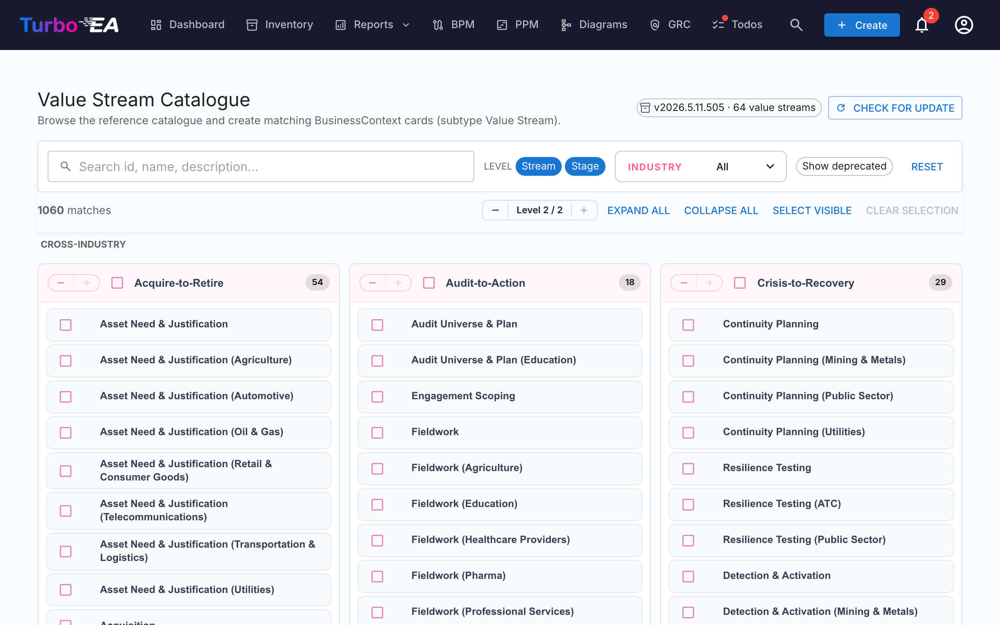

# Værdistrømskatalog

Turbo EA leveres med **Reference­katalog for værdistrømme** — et kurateret sæt af end-to-end-værdistrømme (Acquire-to-Retire, Order-to-Cash, Hire-to-Retire, …) vedligeholdt sammen med kompetence- og proceskatalogerne på [github.com/vincentmakes/turbo-ea-capabilities](https://github.com/vincentmakes/turbo-ea-capabilities). Hver strøm er nedbrudt i trin, der linker til de kompetencer, de udnytter, og de processer, der realiserer dem, og udgør dermed en færdig bro mellem forretningsarkitekturen (kompetencer) og procesarkitekturen (processer).

Siden Værdistrømskatalog lader dig gennemse denne reference og oprette tilsvarende `BusinessContext`-kort (undertype **Value Stream**) i bulk.

## Åbning af siden

Klik på brugerikonet i øverste højre hjørne af appen, udvid **Reference Catalogues** i menuen (sektionen er som standard sammenfoldet for at holde menuen kompakt), og klik derefter på **Value Stream Catalogue**. Siden er tilgængelig for alle med tilladelsen `inventory.view`.

## Hvad du ser

- **Sidehoved** — den aktive katalogversion, antallet af værdistrømme den indeholder, og (for administratorer) kontroller til at tjekke for og hente opdateringer.
- **Filterlinje** — fuldtekstsøgning på tværs af id, navn, beskrivelse og noter, niveau-chips (Stream / Stage), et multi-valg for branche og en "Vis udfasede"-til/fra-knap.
- **L1-gitter** — ét kort pr. strøm, hvor hver strøms trin er listet som børn. Trinnene har deres trinrækkefølge, valgfri branchevariant og id'erne på de kompetencer og processer, de berører.

## Valg af værdistrømme

Marker afkrydsningsfeltet ved siden af en strøm eller et trin for at føje det til valget. Valget kaskaderer på samme måde som de andre kataloger. **Når du vælger et trin, hentes den overordnede strøm automatisk med** ved import, så du ikke ender med forældreløse trin — selv hvis du ikke selv har markeret strømmen.

Strømme og trin, der **allerede findes** i dit lager, vises med et **grønt fluebensikon** i stedet for et afkrydsningsfelt.

## Masseoprettelse af kort

Når du har valgt en eller flere strømme eller trin, vises en fastgjort **Opret N elementer**-knap nederst på siden. Den bruger den almindelige tilladelse `inventory.create`.

Ved bekræftelse vil Turbo EA:

- Oprette ét `BusinessContext`-kort pr. valgt post med undertypen **Value Stream** for både strømme og trin.
- Forbinde hvert trinkorts `parent_id` til dets overordnede strøm, så kataloghierarkiet gengives.
- **Auto-oprette `relBizCtxToBC` (er forbundet med)**-relationer fra hvert nyt trin til hvert eksisterende `BusinessCapability`-kort, som trinnet udnytter (`capability_ids`).
- **Auto-oprette `relProcessToBizCtx` (bruger)**-relationer fra hvert eksisterende `BusinessProcess`-kort til hvert nyt trin (`process_ids`). Bemærk relationens retning: i Turbo EA's metamodel er processen kilden, ikke trinnet.
- Springe alle krydsreferencer over, hvis målkortet endnu ikke findes; kilde-id'erne gemmes i trinnets egenskaber (`capabilityIds`, `processIds`), så du kan forbinde dem senere ved at importere de manglende artefakter.
- Stemple trinkort med `stageOrder`, `stageName`, `industryVariant`, `notes` og de oprindelige `capabilityIds` / `processIds`-lister.

Antal sprungne, oprettede og gen-linkede rapporteres på samme måde som for kompetencekataloget. Importer er idempotente.

## Detaljevisning

Klik på navnet på en strøm eller et trin for at åbne en detaljedialog. For **trin** viser panelet desuden:

- **Stage order** — trinnets ordinale position inden for strømmen.
- **Industry variant** — angivet når trinnet er en branchespecifik specialisering af den tværfaglige baseline.
- **Notes** — friform-detaljer om underomfang fra kataloget.
- **Capabilities at this stage** og **Processes at this stage** — chips for de BC- og BP-id'er, trinnet refererer til. Brug dem til at opdage manglende kort inden import.

## Opdatering af kataloget (administratorer)

Kataloget leveres **medfølgende** som en Python-afhængighed, så siden virker offline / i lukkede miljøer. Administratorer (`admin.metamodel`) kan hente en nyere version efter behov via **Check for update** → **Fetch v…**. Den samme wheel-download hydrerer kompetence- og procescacherne samtidigt, så opdatering af et af de tre referencekataloger opdaterer dem alle.
