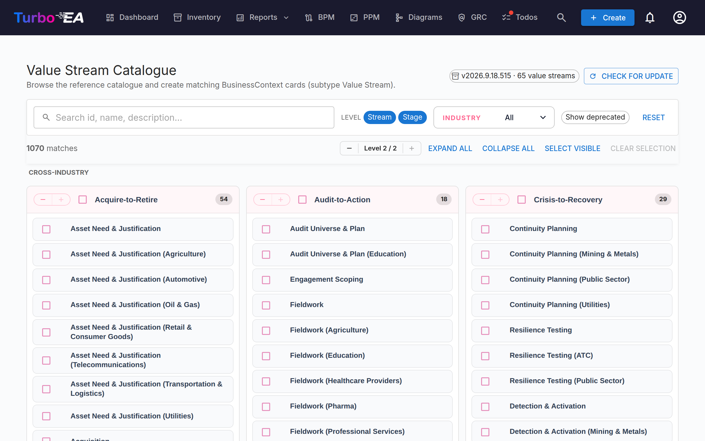

# Value Stream Catalogue

Turbo EA ships with the **Value Stream Reference Catalogue** — a curated set of end-to-end value streams (Acquire-to-Retire, Order-to-Cash, Hire-to-Retire, …) maintained alongside the capability and process catalogues at [github.com/TurboEA/turbo-ea-capabilities](https://github.com/TurboEA/turbo-ea-capabilities). Each stream is broken down into stages that link to the capabilities they exercise and the processes that realise them, providing a ready-made bridge between business architecture (capabilities) and process architecture (processes).

The Value Stream Catalogue page lets you browse this reference and create matching `BusinessContext` cards (subtype **Value Stream**) in bulk.

## Opening the page

Click the user icon in the top-right corner of the app, expand **Reference Catalogues** in the menu (the section is collapsed by default to keep the menu compact), then click **Value Stream Catalogue**. The page is available to anyone with the `inventory.view` permission.

## What you see

- **Header** — the active catalogue version, the number of value streams it contains, and (for admins) controls to check for and fetch updates.
- **Filter bar** — full-text search across id, name, description and notes, level chips (Stream / Stage), an industry multi-select, and a "Show deprecated" toggle.
- **L1 grid** — one card per Stream, with each Stream's stages listed as children. The stages carry their stage order, optional industry variant, and the IDs of the capabilities and processes they touch.

## Selecting value streams

Tick the checkbox next to any stream or stage to add it to the selection. Selection cascades the same way as the other catalogues. **Selecting a stage automatically pulls in its parent stream** at import time, so you don't end up with orphaned stages — even if you haven't ticked the stream yourself.

Streams and stages that **already exist** in your inventory appear with a **green check icon** instead of a checkbox.

## Mass-creating cards

When you have one or more streams or stages selected, a sticky **Create N items** button appears at the bottom of the page. It uses the regular `inventory.create` permission.

On confirmation, Turbo EA:

- Creates one `BusinessContext` card per selected entry, with subtype **Value Stream** for both streams and stages.
- Wires each stage card's `parent_id` to its parent Stream so the catalogue hierarchy is reproduced.
- **Auto-creates `relBizCtxToBC` (is associated with)** relations from each new stage to every existing `BusinessCapability` card the stage exercises (`capability_ids`).
- **Auto-creates `relProcessToBizCtx` (uses)** relations from every existing `BusinessProcess` card to each new stage (`process_ids`). Note the relation direction: in Turbo EA's metamodel the process is the source, not the stage.
- Skips any cross-references whose target card doesn't yet exist; the source IDs are stored on the stage's attributes (`capabilityIds`, `processIds`) so you can wire them later by importing the missing artefacts.
- Stamps stage cards with `stageOrder`, `stageName`, `industryVariant`, `notes`, and the original `capabilityIds` / `processIds` lists.

Skipped, created, and re-linked counts are reported the same way as for the capability catalogue. Imports are idempotent.

## Detail view

Click any stream or stage name to open a detail dialog. For **stages**, the panel additionally shows:

- **Stage order** — the stage's ordinal position within the stream.
- **Industry variant** — set when the stage is an industry-specific specialisation of the cross-industry baseline.
- **Notes** — free-form sub-scope detail from the catalogue.
- **Capabilities at this stage** and **Processes at this stage** — chips for the BC and BP IDs the stage references. Use them to spot missing cards before importing.

## Updating the catalogue (admins)

The catalogue ships **bundled** as a Python dependency, so the page works offline / in airgapped deployments. Admins (`admin.metamodel`) can pull a newer version on demand via **Check for update** → **Fetch v…**. The same wheel download hydrates the capability and process caches at the same time, so updating any one of the three reference catalogues refreshes them all.
