# Manual de Usuario - Turbo EA

## Plataforma de Gestión de Arquitectura Empresarial

**Guía para Directivos y Tomadores de Decisiones** | Febrero 2026

---

## Tabla de Contenidos

1. [Introducción a Turbo EA](#1-introducción-a-turbo-ea)
2. [Acceso a la Plataforma](#2-acceso-a-la-plataforma)
3. [Panel de Control (Dashboard)](#3-panel-de-control-dashboard)
4. [Inventario](#4-inventario)
5. [Detalle de Fichas](#5-detalle-de-fichas)
6. [Informes](#6-informes)
7. [Gestión de Procesos de Negocio (BPM)](#7-gestión-de-procesos-de-negocio-bpm)
8. [Diagramas](#8-diagramas)
9. [Entrega EA](#9-entrega-ea)
10. [Tareas y Encuestas](#10-tareas-y-encuestas)
11. [Administración](#11-administración)
12. [Glosario de Términos](#12-glosario-de-términos)

---

## 1. Introducción a Turbo EA

### ¿Qué es Turbo EA?

**Turbo EA** es una plataforma moderna y autoalojada para la **Gestión de Arquitectura Empresarial**. Permite a las organizaciones documentar, visualizar y gestionar todos los componentes de su arquitectura de negocio y tecnología en un solo lugar.

### ¿Para quién es esta guía?

Esta guía está diseñada para **directivos y tomadores de decisiones** que necesitan evaluar y comprender las capacidades de Turbo EA antes de adoptar la plataforma en su organización. No se requiere conocimiento técnico avanzado para utilizar la herramienta.

### Beneficios Principales

- **Visibilidad completa**: Visualice todas las aplicaciones, procesos, capacidades y tecnologías de la organización en una sola plataforma.
- **Toma de decisiones informada**: Informes visuales que facilitan la evaluación del estado actual de la infraestructura tecnológica.
- **Gestión del ciclo de vida**: Seguimiento del estado de cada componente tecnológico, desde su implementación hasta su retiro.
- **Colaboración**: Múltiples usuarios pueden trabajar simultáneamente, con roles y permisos configurables.
- **Descripciones con IA**: Genere descripciones de fichas con un solo clic usando búsqueda web y un LLM local — consciente del tipo, privacidad primero, y completamente controlado por administradores.
- **Multi-idioma**: Disponible en español, inglés, francés, alemán, italiano, portugués y chino.

### Conceptos Clave

| Término | Significado |
|---------|-------------|
| **Ficha (Card)** | El elemento básico de la plataforma. Representa cualquier componente de la arquitectura: una aplicación, un proceso, una capacidad de negocio, etc. |
| **Tipo de Ficha** | La categoría a la que pertenece una ficha (Aplicación, Proceso de Negocio, Organización, etc.) |
| **Relación** | Una conexión entre dos fichas que describe cómo se relacionan (ej: "utiliza", "depende de", "es parte de") |
| **Metamodelo** | La estructura que define qué tipos de fichas existen, qué campos tienen y cómo se relacionan entre sí |
| **Ciclo de Vida** | El estado temporal de un componente (Activo, En Desarrollo, Retirado, etc.) |
| **BPM** | Gestión de Procesos de Negocio (Business Process Management) |

---

## 2. Acceso a la Plataforma

### Inicio de Sesión

Al acceder a la plataforma, se muestra la pantalla de inicio de sesión donde debe ingresar su correo electrónico y contraseña.

**Pasos para iniciar sesión:**

1. Abra su navegador web e ingrese la URL de la plataforma
2. En el campo **Correo electrónico**, escriba su dirección de correo registrada
3. En el campo **Contraseña**, escriba su contraseña
4. Haga clic en el botón **Iniciar Sesión**

**Nota importante:** El primer usuario que se registre en la plataforma recibirá automáticamente el rol de **Administrador**, lo que le permite configurar todo el sistema.

### Registro de Nuevos Usuarios

Si es la primera vez que accede a la plataforma, puede registrarse haciendo clic en "Registrarse". Los administradores también pueden invitar usuarios desde el panel de administración.

### Cambio de Idioma

La plataforma soporta múltiples idiomas. Para cambiar el idioma:

1. Haga clic en su icono de perfil (esquina superior derecha)
2. Seleccione **Idioma**
3. Elija el idioma deseado (Español, English, Français, Deutsch, Italiano, Português, Chinese)

---

## 3. Panel de Control (Dashboard)

El Panel de Control es la primera pantalla que ve después de iniciar sesión. Proporciona una **visión rápida** del estado general de toda la arquitectura empresarial.

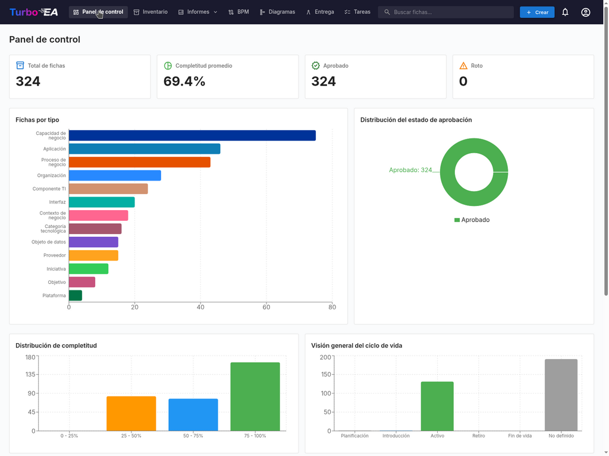

### Elementos del Panel de Control

#### Barra de Navegación Superior

En la parte superior de la pantalla encontrará la **barra de navegación principal** con los siguientes elementos:

- **Turbo EA** (logo): Haga clic para volver al Panel de Control desde cualquier sección
- **Panel de control**: Vista general del estado de la arquitectura
- **Inventario**: Listado completo de todas las fichas (componentes)
- **Informes**: Reportes visuales y analíticos
- **BPM**: Gestión de Procesos de Negocio
- **Diagramas**: Editor visual de diagramas de arquitectura
- **Entrega**: Gestión de proyectos e iniciativas de arquitectura
- **Tareas**: Tareas pendientes y encuestas asignadas
- **Buscar fichas**: Barra de búsqueda rápida
- **+ Crear**: Botón para crear nuevas fichas rápidamente
- **Campana de notificaciones**: Alertas y notificaciones del sistema
- **Icono de perfil**: Configuración personal y administración

#### Tarjetas de Resumen

La sección principal del Panel de Control muestra **tarjetas de resumen** que indican:

- **Número total de fichas**: Cantidad total de componentes registrados en la plataforma (ej: 324 elementos)
- **Distribución por tipo**: Cuántos elementos de cada tipo existen (Aplicaciones, Organizaciones, Objetivos, Capacidades, etc.)
- **Gráficos de estado**: Visualizaciones rápidas del estado general

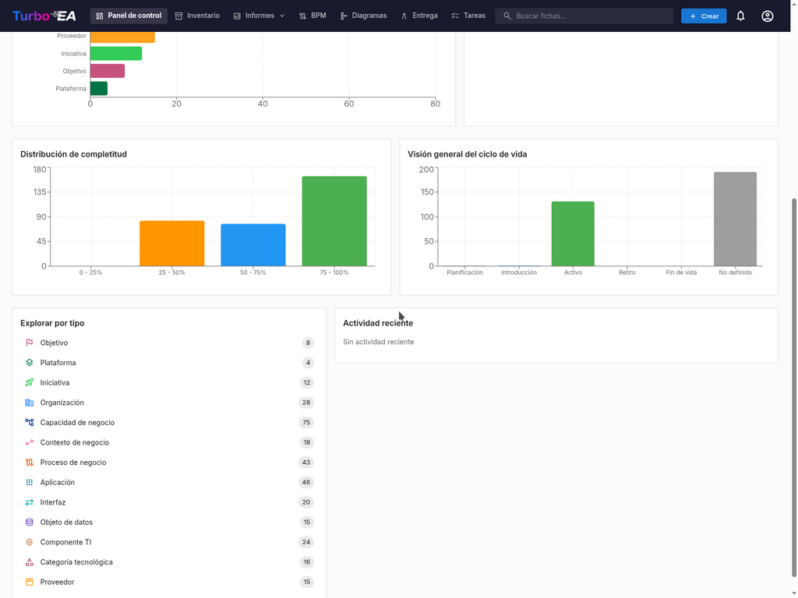

#### Gráficos y Estadísticas

En la parte inferior del Panel de Control encontrará:

- **Gráfico de distribución por tipo**: Muestra la proporción de cada tipo de ficha
- **Estado de aprobación**: Indica cuántas fichas están aprobadas, pendientes o rechazadas
- **Calidad de datos**: Porcentaje general de completitud de la información

---

## 4. Inventario

El **Inventario** es el corazón de Turbo EA. Aquí se listan todas las **fichas** (componentes) de la arquitectura empresarial: aplicaciones, procesos, capacidades de negocio, organizaciones, proveedores, interfaces y más.

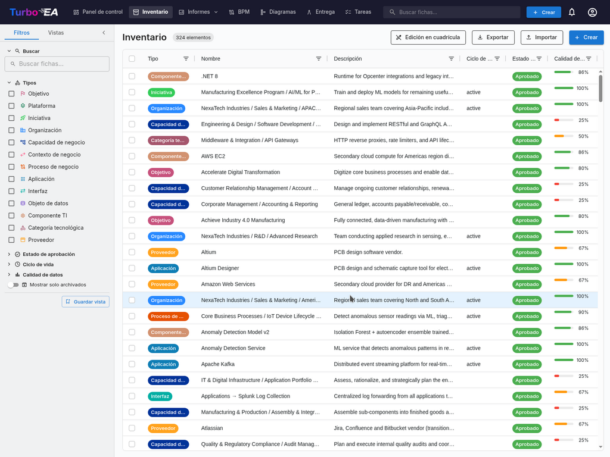

### Estructura de la Pantalla de Inventario

#### Panel de Filtros (Izquierda)

El panel lateral izquierdo permite **filtrar** las fichas por diferentes criterios:

- **Buscar**: Campo de búsqueda por texto libre
- **Tipos**: Filtrar por tipo de ficha: Objetivo, Plataforma, Iniciativa, Organización, Capacidad de Negocio, Contexto de Negocio, Proceso de Negocio, Aplicación, Interfaz, Objeto de Datos, Componente TI, Categoría Tecnológica, Proveedor
- **Estado de Aprobación**: Filtrar por fichas aprobadas, pendientes o rechazadas
- **Ciclo de Vida**: Filtrar por estado del ciclo de vida (Activo, En Desarrollo, Retirado, etc.)
- **Calidad de Datos**: Filtrar por nivel de completitud de datos
- **Mostrar solo archivados**: Opción para ver fichas archivadas
- **Guardar vista**: Guardar configuraciones de filtros para reutilizarlas

#### Tabla Principal (Centro)

| Columna | Descripción |
|---------|-------------|
| **Tipo** | Categoría de la ficha (con código de color) |
| **Nombre** | Nombre del componente |
| **Descripción** | Descripción breve del componente |
| **Ciclo de vida** | Estado actual (activo, retirado, etc.) |
| **Estado de aprobación** | Si ha sido aprobado por los responsables |
| **Calidad de datos** | Porcentaje de completitud (barra de progreso) |

#### Barra de Herramientas (Superior Derecha)

- **Edición en cuadrícula**: Editar múltiples fichas simultáneamente en modo tabla
- **Exportar**: Descargar datos en formato Excel
- **Importar**: Carga masiva de datos desde archivos Excel
- **+ Crear**: Crear una nueva ficha

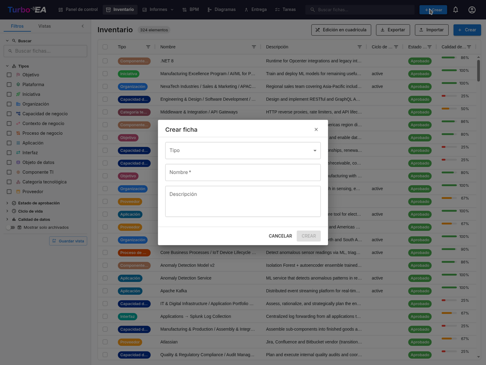

### Cómo Crear una Nueva Ficha

1. Haga clic en el botón **+ Crear** (azul, esquina superior derecha)
2. En el diálogo que aparece:
   - Seleccione el **Tipo** de ficha (Aplicación, Proceso, Objetivo, etc.)
   - Ingrese el **Nombre** del componente
   - Opcionalmente, agregue una **Descripción**
3. Opcionalmente, haga clic en **Sugerir con IA** para generar una descripción automáticamente (consulte [Sugerencias de Descripción con IA](#sugerencias-de-descripción-con-ia) a continuación)
4. Haga clic en **CREAR**

### Sugerencias de Descripción con IA

Turbo EA puede usar **IA para generar una descripción** para cualquier ficha. Esto funciona tanto en el diálogo de creación como en las páginas de detalle de fichas existentes.

**Cómo funciona:**

1. Ingrese un nombre de ficha y seleccione un tipo
2. Haga clic en el **icono de destello** (✨) en el encabezado de la ficha, o en el botón **Sugerir con IA** en el diálogo de creación
3. El sistema realiza una **búsqueda web** del nombre del elemento (usando contexto según el tipo — por ejemplo, «SAP S/4HANA software application»), y luego envía los resultados a un **LLM local** (Ollama) para generar una descripción concisa y factual
4. Aparece un panel de sugerencias con:
   - **Descripción editable** — revise y modifique el texto antes de aplicarlo
   - **Puntuación de confianza** — indica qué tan segura está la IA (Alta / Media / Baja)
   - **Enlaces a fuentes** — las páginas web de las que se extrajo la descripción
   - **Nombre del modelo** — qué LLM generó la sugerencia
5. Haga clic en **Aplicar descripción** para guardar, o **Ignorar** para descartar

**Características principales:**

- **Consciente del tipo**: La IA entiende el contexto del tipo de ficha. Una búsqueda de «Aplicación» agrega «software application», un «Proveedor» agrega «technology vendor», una «Organización» agrega «company», etc.
- **Privacidad primero**: El LLM se ejecuta localmente vía Ollama — sus datos nunca salen de su infraestructura
- **Controlado por administradores**: Las sugerencias de IA deben ser habilitadas por un administrador en Configuración → IA Cards. Los administradores pueden elegir qué tipos de fichas muestran el botón de sugerencia, configurar la URL del proveedor de LLM y el modelo, y seleccionar el proveedor de búsqueda web (DuckDuckGo, Google Custom Search o SearXNG)
- **Basado en permisos**: Solo los usuarios con el permiso `ai.suggest` pueden usar esta función (habilitado por defecto para los roles Admin, BPM Admin y Miembro)
6. Haga clic en **CREAR**

---

## 5. Detalle de Fichas

Al hacer clic en cualquier ficha del inventario, se abre la **vista de detalle** donde puede ver y editar toda la información del componente.

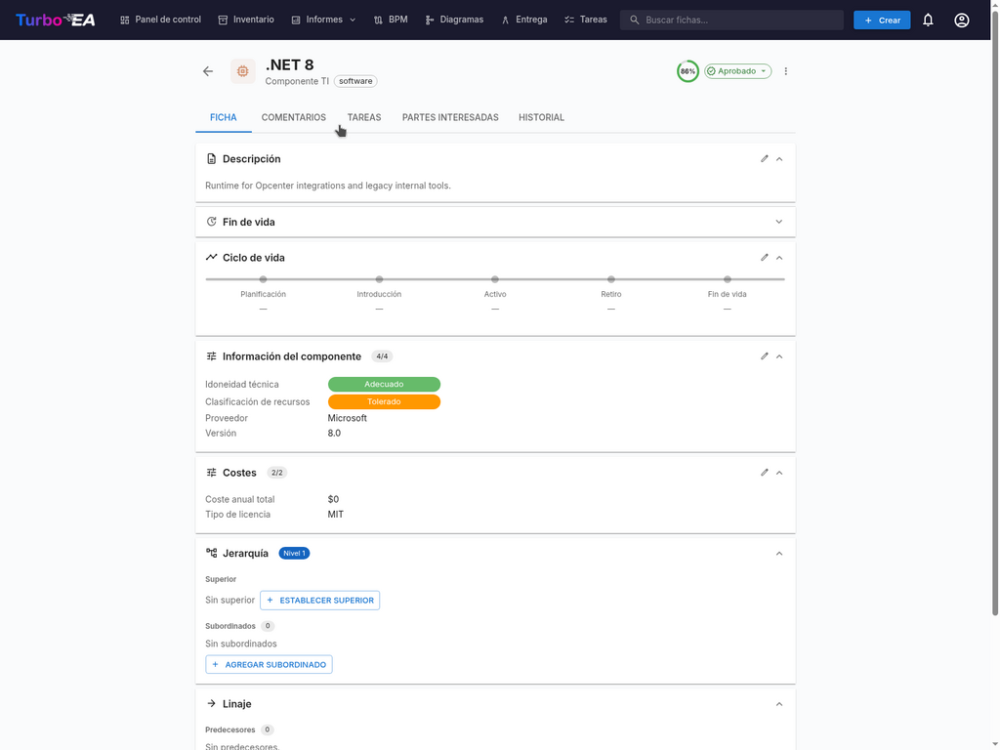

### Pestañas Disponibles en el Detalle de Ficha

#### Pestaña "Detalle" (Principal)

- **Nombre y tipo** de la ficha (esquina superior izquierda)
- **Botón de sugerencia IA** (✨): Haga clic para generar una descripción con IA (visible cuando la IA está habilitada y el usuario tiene permiso de edición)
- **Estado de aprobación**: Insignia verde "Aprobado" o estado pendiente
- **Descripción**: Texto descriptivo sobre el componente
- **Atributos personalizados**: Campos específicos según el tipo de ficha
- **Relaciones**: Lista de conexiones con otras fichas
- **Ciclo de vida**: Estado temporal del componente
- **Etiquetas**: Clasificaciones adicionales asignadas

#### Pestaña "Comentarios"

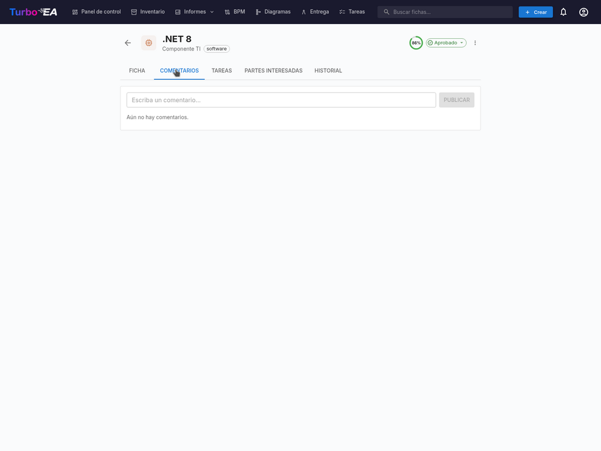

- **Agregar comentarios**: Cualquier usuario puede dejar notas o preguntas sobre el componente
- **Discusión en equipo**: Los comentarios crean un hilo de conversación
- **Historial de decisiones**: Documente el razonamiento detrás de cambios importantes

#### Pestaña "Tareas"

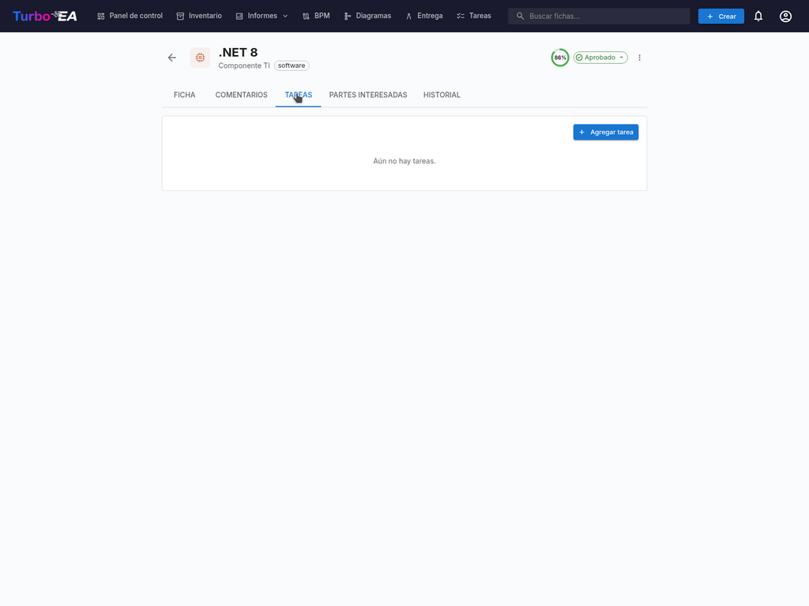

- **Crear nueva tarea**: Asigne tareas a miembros del equipo
- **Estado de la tarea**: Pendiente, En Progreso, Completada
- **Asignado a**: Persona responsable de completar la tarea
- **Fecha límite**: Fecha máxima para completar la tarea

#### Pestaña "Partes Interesadas"

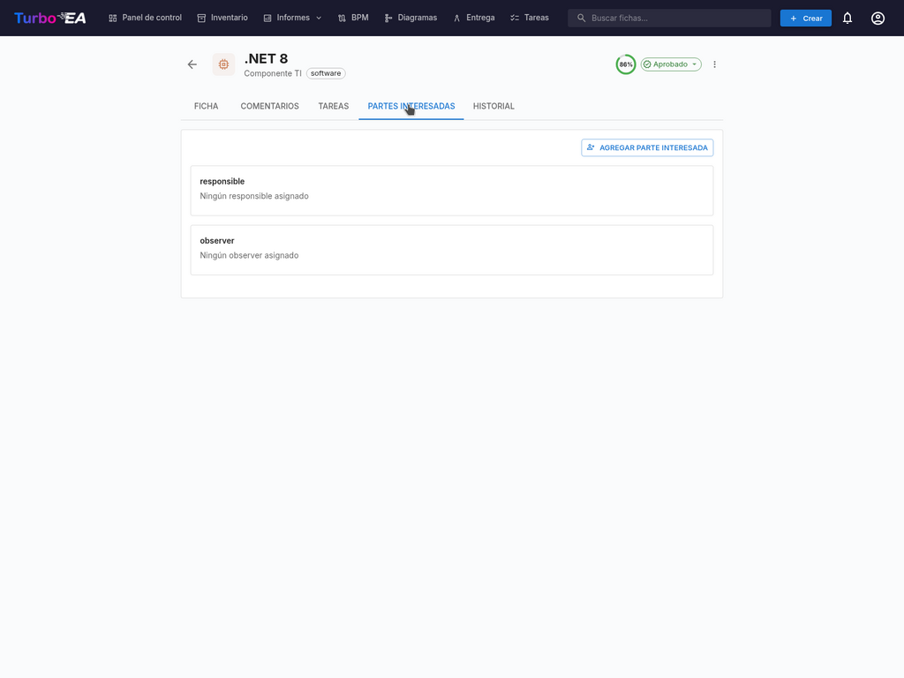

- **Propietario de Negocio**: Responsable de las decisiones de negocio
- **Propietario Técnico**: Responsable de las decisiones técnicas
- **Otros roles**: Según la configuración del metamodelo

#### Pestaña "Historial"

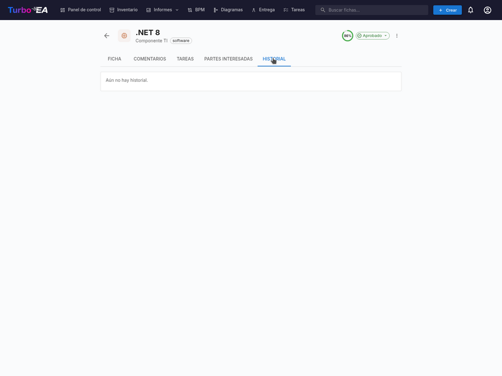

Muestra el **registro completo de cambios** realizados en la ficha: **Quién** hizo el cambio, **Cuándo** se realizó, **Qué** se modificó (valor anterior vs. valor nuevo). Esto permite una **auditoría completa** de todas las modificaciones.

---

## 6. Informes

Turbo EA incluye un potente módulo de **informes visuales** que permite analizar la arquitectura empresarial desde diferentes perspectivas. Los informes están diseñados para facilitar la **toma de decisiones** por parte de los directivos.

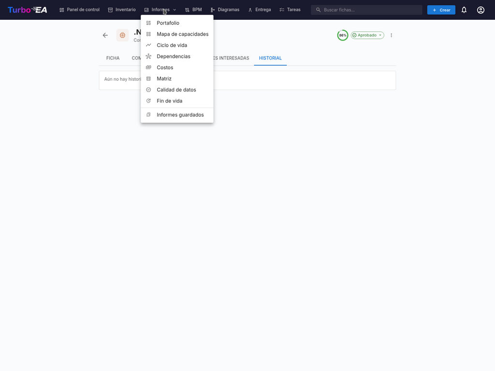

### 6.1 Informe de Portafolio

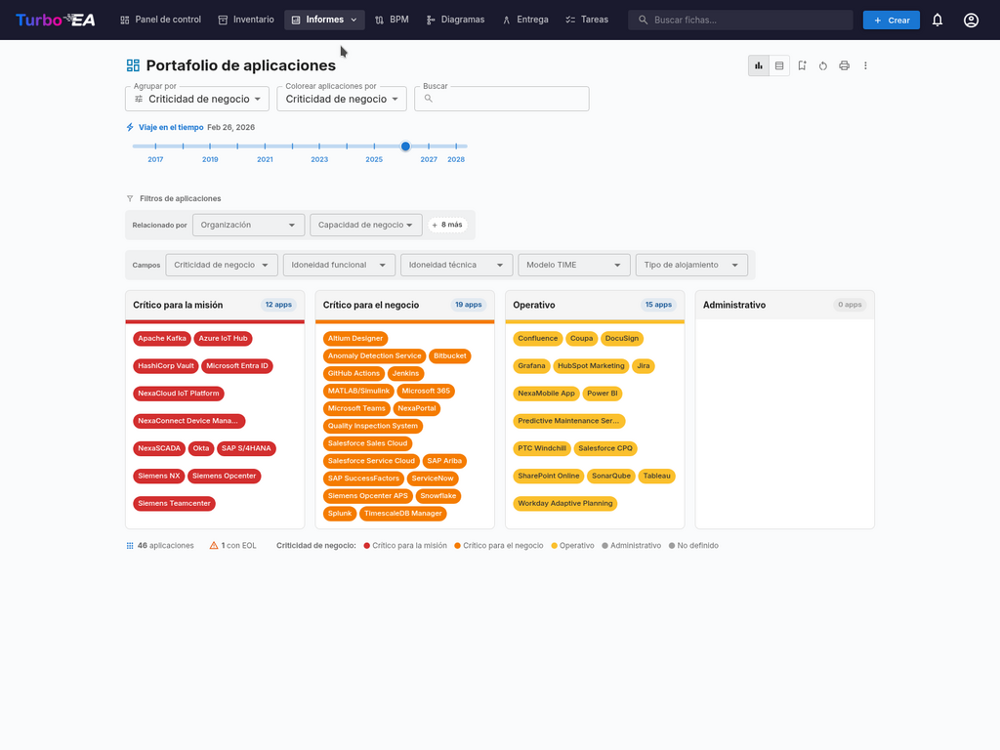

El **Informe de Portafolio** proporciona una **visión general de todos los componentes de la arquitectura** agrupados por tipo. Es ideal para evaluar el tamaño del portafolio tecnológico, identificar áreas de concentración, comparar categorías y filtrar por diferentes criterios.

### 6.2 Mapa de Capacidades

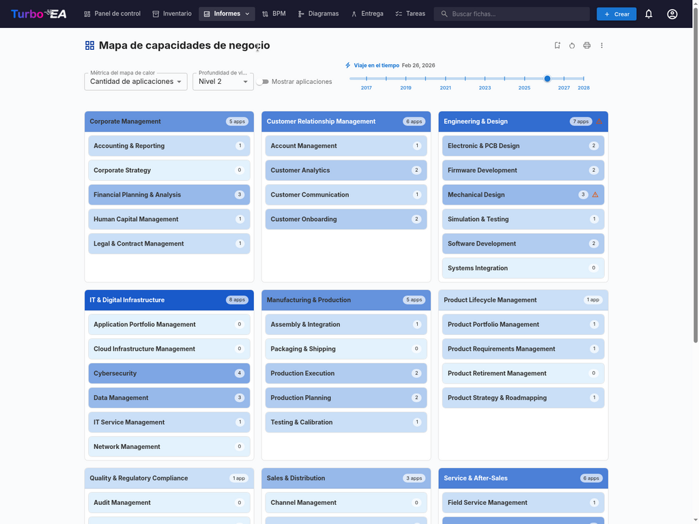

El **Mapa de Capacidades** muestra una vista jerárquica de las **capacidades de negocio** de la organización. Cada bloque representa una capacidad de negocio, los colores pueden indicar el nivel de madurez o estado, y la jerarquía muestra las capacidades principales y sus sub-capacidades.

### 6.3 Ciclo de Vida

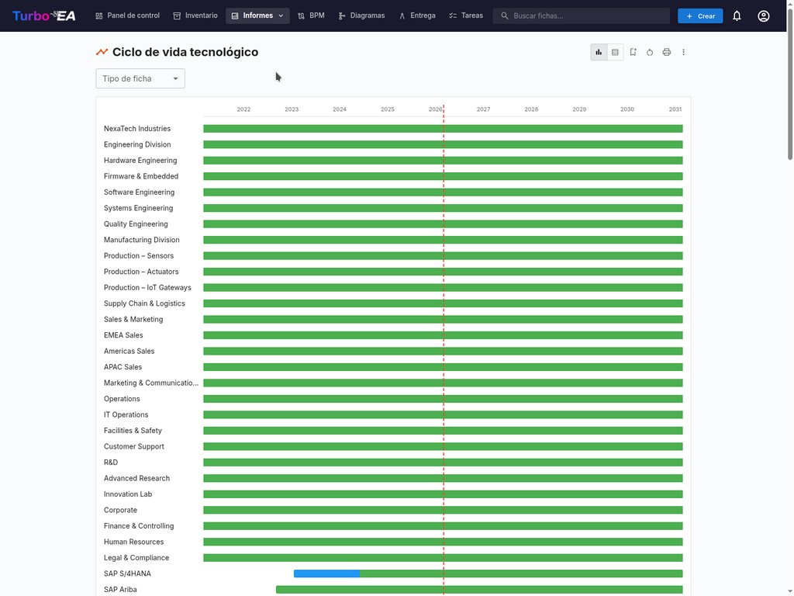

El **Informe de Ciclo de Vida** muestra el estado temporal de los componentes tecnológicos. Es crítico para la planificación de retiro, la gestión de obsolescencia y la planificación presupuestaria. Estados: **Activo**, **En Desarrollo**, **En Fase de Retiro**, **Retirado**.

### 6.4 Dependencias

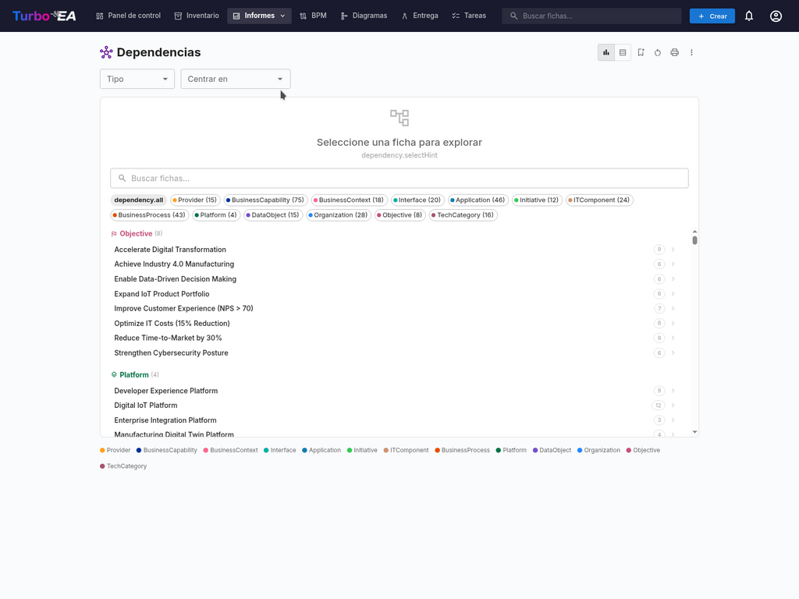

El **Informe de Dependencias** visualiza las **conexiones entre componentes**. Fundamental para el análisis de impacto, la identificación de puntos críticos, la planificación de migraciones y la reducción de riesgos.

### 6.5 Otros Informes Disponibles

- **Informe de Costos**: Análisis de costos de licenciamiento, mantenimiento y operación
- **Informe de Matriz**: Vista cruzada que compara dos dimensiones de la arquitectura
- **Calidad de Datos**: Muestra qué fichas tienen información incompleta
- **Mapa de Procesos**: Visualización de la cadena de procesos de negocio
- **Fin de Vida (EOL)**: Fechas de fin de soporte de productos tecnológicos

---

## 7. Gestión de Procesos de Negocio (BPM)

El módulo **BPM** permite documentar y analizar los **procesos de negocio** de la organización.

### 7.1 Navegador de Procesos

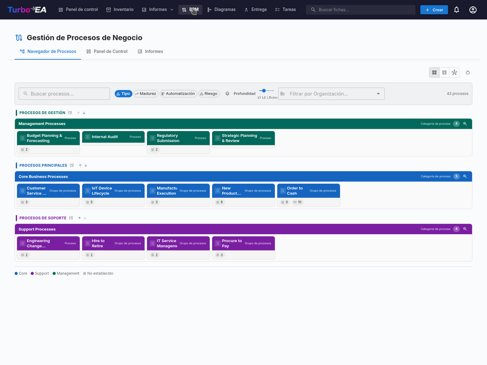

El **Navegador de Procesos** organiza los procesos en tres categorías principales: **Procesos de Gestión** (planificación y control), **Procesos de Negocio Principal** (actividad principal del negocio) y **Procesos de Soporte** (apoyo a las actividades principales).

**Filtros disponibles:** Tipo, Madurez (Inicial/Definido/Gestionado/Optimizado), Automatización, Riesgo (Bajo/Medio/Alto/Crítico), Profundidad (L1/L2/L3).

### 7.2 Panel de Control BPM

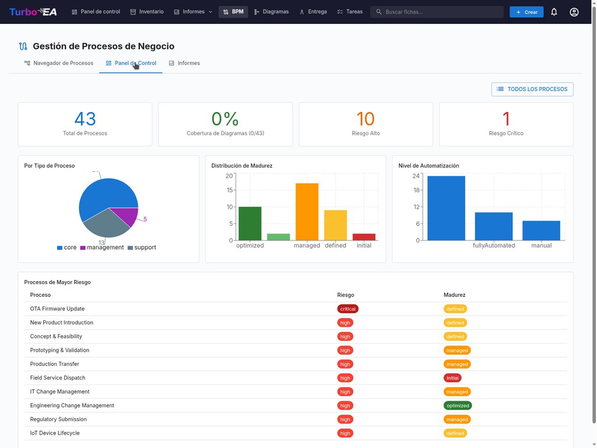

El **Panel de Control BPM** ofrece una **visión ejecutiva** del estado de los procesos:

| Indicador | Descripción |
|-----------|-------------|
| **Total de Procesos** | Número total de procesos documentados |
| **Cobertura de Diagramas** | Porcentaje de procesos con diagramas asociados |
| **Riesgo Alto** | Número de procesos con nivel de riesgo alto |
| **Riesgo Crítico** | Número de procesos con nivel de riesgo crítico |

Incluye gráficos que muestran la distribución por tipo de proceso, madurez y nivel de automatización, además de una tabla de procesos con mayor riesgo para **priorizar inversiones**.

---

## 8. Diagramas

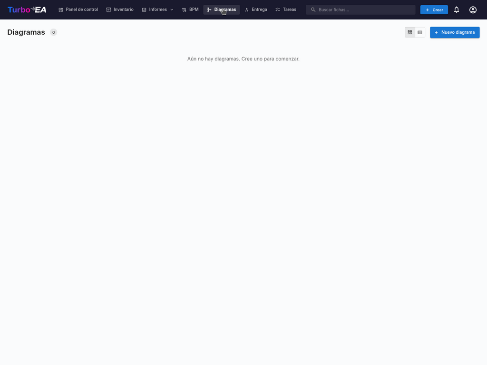

El módulo de **Diagramas** permite crear **representaciones visuales** de la arquitectura empresarial. Funcionalidades: arrastrar y soltar componentes, conexiones automáticas entre fichas, colores y formas personalizables, exportar como imagen y sincronización de datos.

---

## 9. Entrega EA

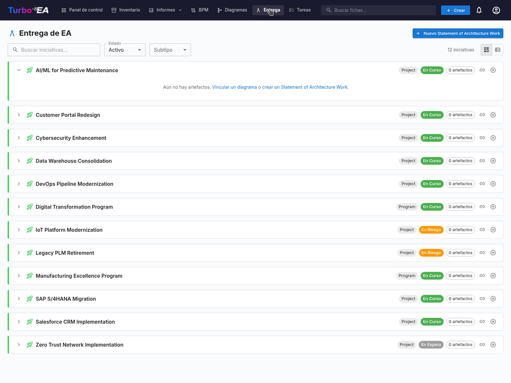

El módulo de **Entrega** gestiona las **iniciativas y proyectos** relacionados con la arquitectura empresarial.

| Campo | Descripción |
|-------|-------------|
| **Nombre** | Nombre descriptivo del proyecto o programa |
| **Tipo** | Proyecto o Programa |
| **Estado** | En Curso (verde), En Riesgo (naranja), Completado, etc. |
| **Artefactos** | Número de documentos y diagramas asociados |

Incluye la posibilidad de crear un **Documento de Trabajo de Arquitectura (SoAW)** para cada iniciativa.

---

## 10. Tareas y Encuestas

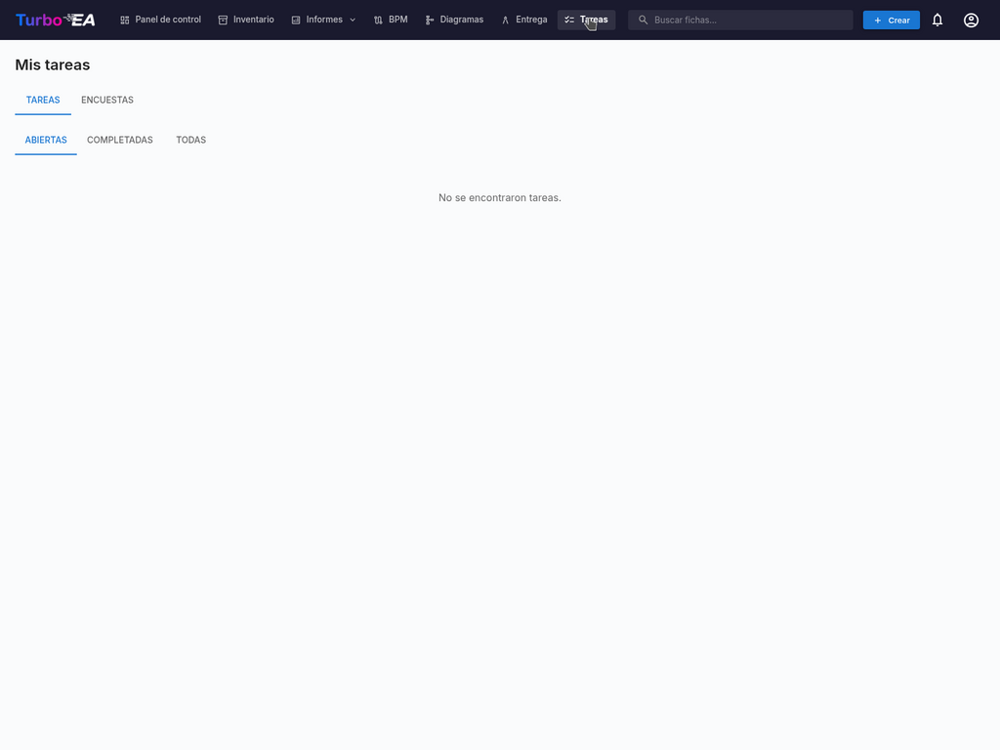

El módulo de **Tareas** centraliza todas las actividades pendientes. Filtros: **ABIERTAS**, **COMPLETADAS**, **TODAS**. La pestaña **Encuestas** permite recopilar información de diferentes partes interesadas.

---

## 11. Administración

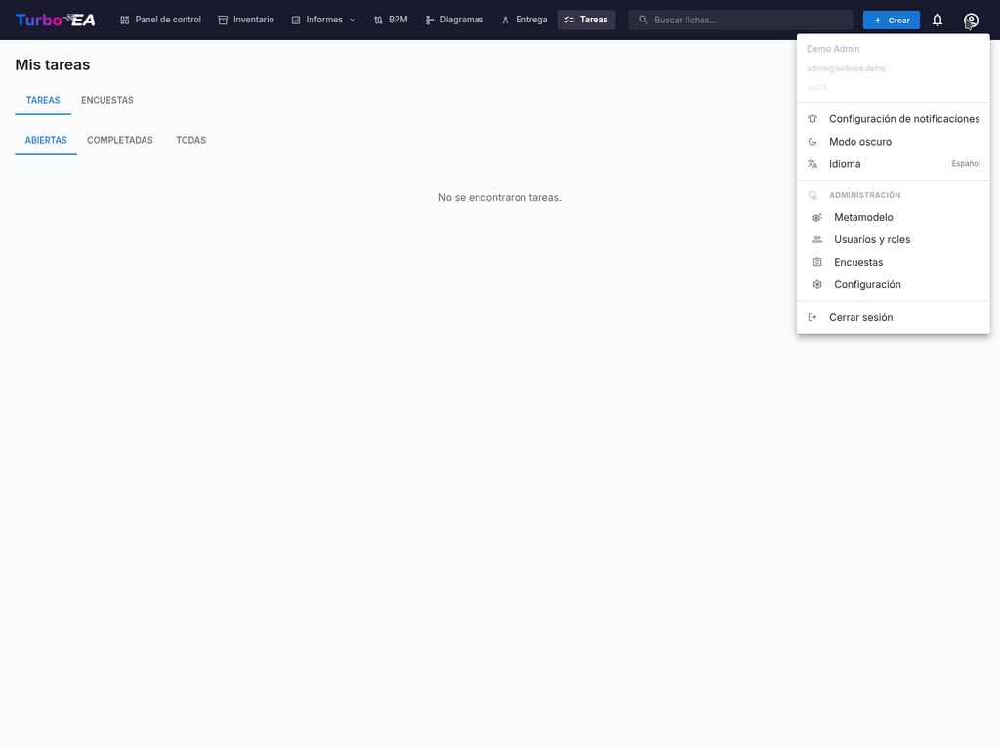

### 11.1 Metamodelo

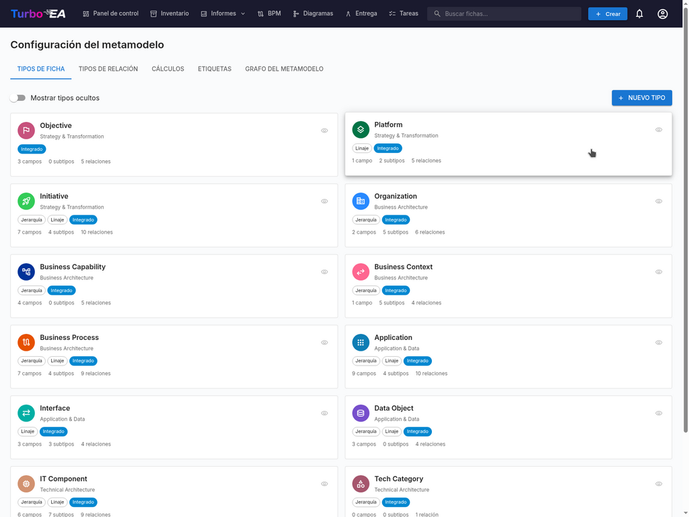

El **Metamodelo** define la estructura de la plataforma. Pestañas: **Tipos de Ficha**, **Tipos de Relación**, **Cálculos**, **Etiquetas**, **Grafo del Metamodelo**. Tipos incluidos: Objetivo, Plataforma, Iniciativa, Organización, Capacidad de Negocio, Contexto de Negocio, Proceso de Negocio, Aplicación, Interfaz, Objeto de Datos, Componente TI, Categoría Tecnológica, Proveedor.

### 11.2 Usuarios y Roles

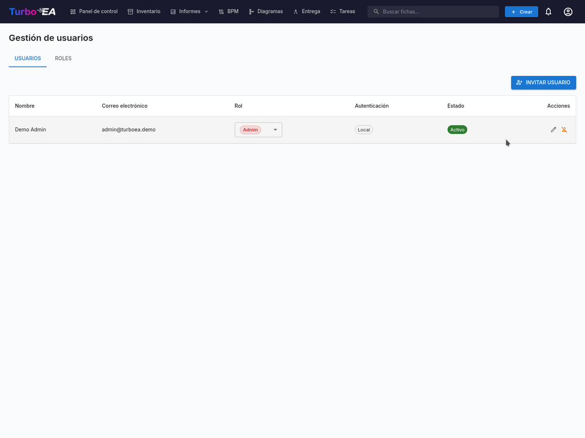

Gestione usuarios (Nombre, Correo, Rol, Autenticación, Estado) e invite nuevos miembros. Roles: **Administrador** (acceso total), **Editor** (crear/modificar), **Visor** (solo lectura), y roles personalizados.

---

## 12. Glosario de Términos

| Término | Definición |
|---------|------------|
| **Arquitectura Empresarial (EA)** | La disciplina que organiza y documenta la estructura de una organización |
| **BPM** | Gestión de Procesos de Negocio (Business Process Management) |
| **Capacidad de Negocio** | Lo que una organización puede hacer, independientemente de cómo lo hace |
| **Ciclo de Vida** | Fases por las que pasa un componente: desde su creación hasta su retiro |
| **Ficha (Card)** | La unidad básica de información en Turbo EA que representa un componente |
| **Iniciativa** | Un proyecto o programa que implica cambios en la arquitectura |
| **Metamodelo** | El modelo que define la estructura de datos de la plataforma |
| **Portafolio** | Un conjunto de aplicaciones o tecnologías gestionadas como un grupo |
| **SoAW** | Documento de Trabajo de Arquitectura (Statement of Architecture Work) |
| **Parte Interesada (Stakeholder)** | Persona con interés o responsabilidad sobre un componente |
| **SSO** | Inicio de Sesión Único - Acceso con credenciales corporativas |

---

**Turbo EA v0.21.0** | Plataforma de Gestión de Arquitectura Empresarial

*Este manual fue generado para la evaluación de la plataforma por directivos.*
